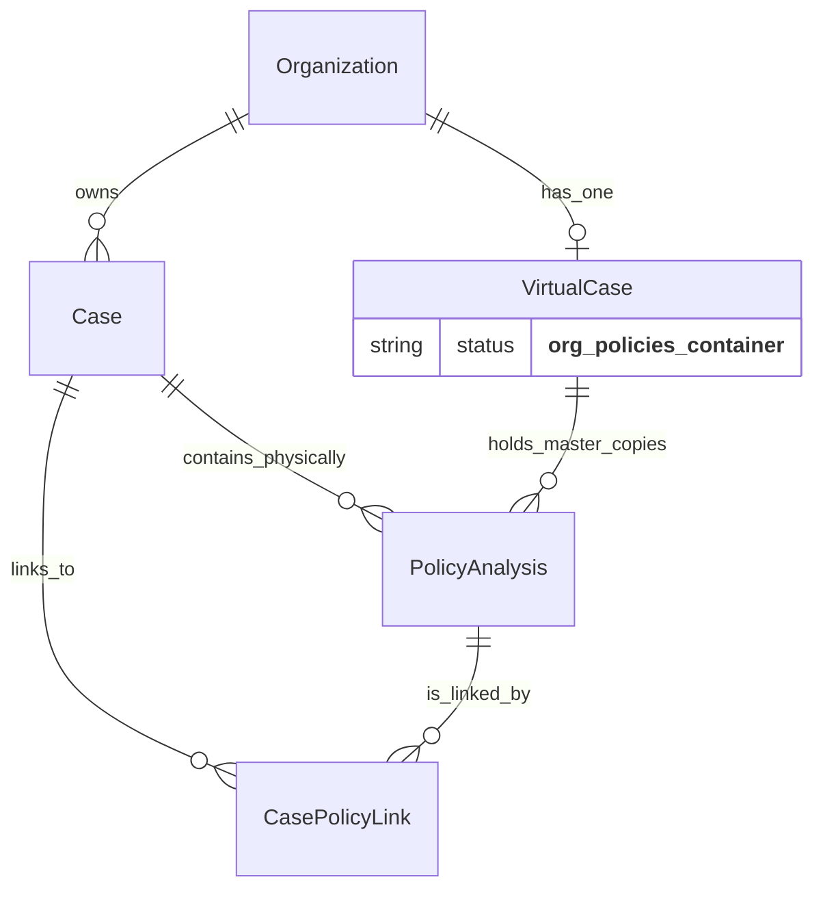

# 🗄️ ESQUEMA DE BASE DE DATOS - BRIKI V2

**Versión:** 2.1
**Motor:** PostgreSQL (Supabase)
**ORM:** Prisma

---

## 1. MODELOS PRINCIPALES

### `Case` (Tabla: `cases`)
Representa un hilo de trabajo o "expediente". Puede ser un caso real (con un cliente) o un contenedor de sistema.

| Campo | Tipo | Descripción |
|-------|------|-------------|
| `id` | UUID | Identificador único |
| `orgId` | UUID | Organización propietaria (Multi-tenancy) |
| `status` | String | Estado (`active`, `draft`, `closed`... o `__org_policies_container__`) |
| `stage` | String | Etapa del flujo (`initial`, `analysis`... o `__system__`) |
| `briefData` | JSON | Datos estructurados del caso (cliente, necesidades) |

### `PolicyAnalysis` (Tabla: `policy_analyses`)
Almacena la data extraída y estructurada de una póliza (PDF).

| Campo | Tipo | Descripción |
|-------|------|-------------|
| `id` | UUID | Identificador único |
| `caseId` | UUID | Caso "dueño" (puede ser el Caso Virtual) |
| `extractedData` | JSON | Datos crudos extraídos por IA |
| `structuredData` | JSON | Datos normalizados |

### `CasePolicyLink` (Tabla: `case_policy_links`)
**[NUEVO]** Tabla de relación N:M que permite vincular pólizas a múltiples casos.

| Campo | Tipo | Descripción |
|-------|------|-------------|
| `id` | UUID | PK |
| `caseId` | UUID | FK -> `Case` (El caso que "usa" la póliza) |
| `policyAnalysisId` | UUID | FK -> `PolicyAnalysis` (La póliza usada) |
| `orgId` | UUID | FK -> `Organization` (Seguridad RLS) |
| `linkType` | String | Tipo de vínculo (ej. `'reference'`) |

---

## 2. RELACIONES CLAVE

### El Modelo de "Biblioteca de Pólizas"

1.  **Almacenamiento Físico:** Las pólizas subidas a la "biblioteca" se guardan físicamente en el `Case` virtual (`status='__org_policies_container__'`).
2.  **Visualización Lógica:** Cuando un caso real necesita una póliza de la biblioteca, **NO** se duplica la póliza. Se crea un registro en `CasePolicyLink`.
3.  **Consultas:** El backend consulta:
    *   Pólizas propias (`where caseId = currentCaseId`)
    *   **MÁS** Pólizas vinculadas (`join CasePolicyLink`)

---

## 3. SEGURIDAD (Row Level Security - RLS)

Todas las tablas críticas tienen habilitado RLS en Supabase para garantizar el aislamiento entre organizaciones (Multi-tenancy).

*   **Política Base:** `auth.uid() IN (SELECT user_id FROM org_members WHERE org_id = current_table.org_id)`
*   Esto asegura que un usuario NUNCA pueda ver datos de una organización a la que no pertenece, incluso si conoce los UUIDs.
