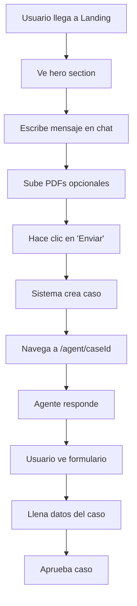
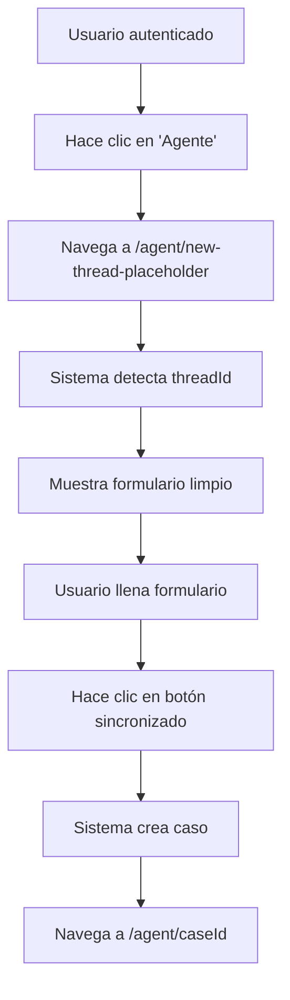
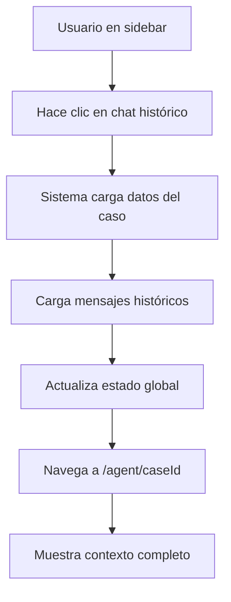

# GUÍA DE ONBOARDING PARA NUEVOS DESARROLLADORES

**Versión**: 1.0  
**Fecha**: 29 de Enero, 2025  
**Audiencia**: Nuevos desarrolladores del equipo Briki

---

## 🎯 OBJETIVO

Esta guía te llevará paso a paso desde la configuración inicial hasta tu primera contribución al proyecto Briki. Al finalizar, tendrás una comprensión completa de la arquitectura y podrás desarrollar nuevas funcionalidades de manera independiente.

---

## 📋 PREREQUISITOS

### **Conocimientos Técnicos Requeridos**
- **JavaScript/TypeScript** (intermedio)
- **React** (intermedio)
- **Next.js** (básico)
- **Git** (básico)
- **SQL** (básico)

### **Herramientas Necesarias**
- **Node.js** 18+ 
- **pnpm** (gestor de paquetes)
- **VS Code** (recomendado)
- **Git** configurado
- **Cuenta de Supabase** (se proporcionará acceso)

---

## 🚀 CONFIGURACIÓN INICIAL

### **Paso 1: Clonar el Repositorio**

```bash
# Clonar el repositorio
git clone https://github.com/tu-org/briki.git
cd briki

# Verificar que estás en la rama main
git branch
```

### **Paso 2: Instalar Dependencias**

```bash
# Instalar dependencias
pnpm install

# Verificar instalación
pnpm --version
```

### **Paso 3: Configurar Variables de Entorno**

```bash
# Copiar archivo de ejemplo
cp .env.example .env.local

# Editar variables de entorno
nano .env.local
```

**Variables requeridas:**
```bash
# Supabase (se proporcionarán)
NEXT_PUBLIC_SUPABASE_URL=your_supabase_url
NEXT_PUBLIC_SUPABASE_ANON_KEY=your_anon_key
SUPABASE_SERVICE_ROLE_KEY=your_service_role_key

# Base de datos
DATABASE_URL=your_database_url
DIRECT_URL=your_direct_url

# OpenAI (se proporcionará)
OPENAI_API_KEY=your_openai_key

# Autenticación
NEXTAUTH_SECRET=your_secret
GOOGLE_CLIENT_ID=your_google_client_id
GOOGLE_CLIENT_SECRET=your_google_client_secret
```

### **Paso 4: Configurar Base de Datos**

```bash
# Aplicar migraciones
npx prisma db push

# Generar cliente Prisma
npx prisma generate

# Verificar conexión
npx prisma studio
```

### **Paso 5: Iniciar Servidor de Desarrollo**

```bash
# Iniciar servidor
pnpm dev

# Verificar que funciona
# Abrir http://localhost:3000
```

---

## 🏗️ ARQUITECTURA DEL PROYECTO

### **Visión General**

Briki es una aplicación de gestión de pólizas de seguros con **arquitectura dual**:

1. **Workspace** (`/workspace`) - Gestión tradicional de casos
2. **Agent** (`/agent`) - Interacción con IA para análisis

### **Estructura de Directorios**

```
src/
├── app/                    # Next.js App Router
│   ├── [locale]/          # Páginas con internacionalización
│   ├── api/               # API Routes
│   └── auth/              # Autenticación
├── components/            # Componentes React
│   ├── Chat/             # Componentes de chat
│   ├── Landing/          # Componentes de landing
│   ├── Workspace/        # Componentes de workspace
│   └── ui/               # Componentes base
├── lib/                  # Utilidades y configuración
│   ├── supabase/         # Clientes Supabase
│   ├── ui/               # Estado global (Zustand)
│   └── helpers/          # Funciones auxiliares
└── messages/             # Traducciones
```

### **Tecnologías Principales**

| Tecnología | Propósito | Ubicación |
|------------|-----------|-----------|
| **Next.js 15** | Framework principal | `src/app/` |
| **React 19** | UI Components | `src/components/` |
| **Zustand** | Estado global | `src/lib/ui/state.ts` |
| **Prisma** | ORM | `src/lib/prisma.ts` |
| **Supabase** | Auth + DB | `src/lib/supabase/` |
| **Tailwind** | Estilos | `tailwind.config.ts` |

---

## 🔄 FLUJOS PRINCIPALES

### **Flujo 1: Usuario Nuevo → Primer Caso**



**Archivos clave:**
- `src/components/Landing/LandingChatInput.tsx`
- `src/app/api/chat/start/route.ts`
- `src/components/Chat/ConversationPane.tsx`

### **Flujo 2: Usuario Existente → Nuevo Chat**



**Archivos clave:**
- `src/components/HomeClient.tsx`
- `src/components/Workspace/CaseBriefForm.tsx`
- `src/app/api/cases/create/route.ts`

### **Flujo 3: Chat Histórico**



**Archivos clave:**
- `src/components/SidebarChatPanel.tsx`
- `src/app/api/cases/[id]/route.ts`
- `src/app/api/cases/[id]/messages/route.ts`

---

## 🗄️ GESTIÓN DE ESTADO

### **Zustand Store Principal**

El estado global se maneja en `src/lib/ui/state.ts`:

```typescript
interface UIState {
  // Navegación
  step: UIStep;                    // Paso actual de la app
  currentCaseId: string | null;   // ID del caso activo
  
  // Autenticación
  initialMessage?: string;        // Mensaje inicial del usuario
  
  // Brief del caso
  brief: CaseBrief;               // Datos del formulario
  isBriefValid: () => boolean;    // Validación del brief
  
  // Mensajes del chat
  messages: ChatMessage[];        // Historial de mensajes
  
  // UI
  rightOpen: boolean;             // Panel derecho abierto
  chatPanelOpen: boolean;         // Panel de chats abierto
  sidebarOpen: boolean;           // Sidebar abierto
  
  // Funciones
  setStep: (step: UIStep) => void;
  setCurrentCaseId: (id: string | null) => void;
  setBrief: (brief: Partial<CaseBrief>) => void;
  setMessages: (messages: ChatMessage[]) => void;
  addMessage: (message: ChatMessage) => void;
}
```

### **Uso en Componentes**

```typescript
import { useUI } from '@/lib/ui/state';

function MyComponent() {
  // Leer estado
  const { step, currentCaseId, messages } = useUI();
  
  // Leer funciones
  const { setStep, setCurrentCaseId, addMessage } = useUI();
  
  // Usar funciones
  const handleClick = () => {
    setStep('conversation');
    setCurrentCaseId('case-123');
  };
  
  return <button onClick={handleClick}>Click me</button>;
}
```

---

## 🗃️ BASE DE DATOS

### **Modelos Principales**

```prisma
model Case {
  id                 String     @id @default(dbgenerated("gen_random_uuid()")) @db.Uuid
  orgId              String?    @map("org_id") @db.Uuid
  clientName         String?    @map("client_name") @db.VarChar(255)
  status             String     @default("draft") @db.VarChar(50)
  stage              String     @default("initial") @db.VarChar(50)
  briefData          Json?      @map("brief_data")
  insurance_category String?
  max_budget         Decimal?   @map("max_budget") @db.Decimal(10, 2) // Validado: -99,999,999.99 a 99,999,999.99
  budget_currency    String?    @default("COP") @map("budget_currency") @db.VarChar(3)
  required_coverages String[]   @default([]) @map("required_coverages")
  client_profile     String?    @map("client_profile")
  createdAt          DateTime   @default(now()) @map("created_at") @db.Timestamptz(6)
  updatedAt          DateTime   @updatedAt @map("updated_at") @db.Timestamptz(6)
  
  // Relaciones
  messages    Message[]
  artifacts   Artifact[]
}

model Message {
  id        String   @id @default(dbgenerated("gen_random_uuid()")) @db.Uuid
  caseId    String   @map("case_id") @db.Uuid
  role      String   // "user" | "assistant" | "system"
  content   Bytes    // ✅ ENCRIPTADO (BYTEA) - Usar encryptMessageContent()/decryptMessages()
  metadata  Json?
  createdAt DateTime @default(now()) @map("created_at") @db.Timestamptz(6)
  
  // Relaciones
  case      Case @relation(fields: [caseId], references: [id], onDelete: Cascade)
}

model Artifact {
  id          String     @id @default(dbgenerated("gen_random_uuid()")) @db.Uuid
  caseId      String     @map("case_id") @db.Uuid
  sourceType  SourceType @map("source_type")
  fileName    String?    @map("file_name") @db.VarChar(255)
  contentText String?    @map("content_text")
  provenance  Json?
  createdAt   DateTime   @default(now()) @map("created_at") @db.Timestamptz(6)
  
  // Relaciones
  case        Case @relation(fields: [caseId], references: [id], onDelete: Cascade)
}

model Profile {
  id        String   @id @db.Uuid
  name      Bytes?   @map("name_enc") // ✅ ENCRIPTADO (BYTEA) - Usar encryptProfileName()/decryptProfileName()
  phone     Bytes?   // ✅ ENCRIPTADO (BYTEA) - Usar encryptProfilePhone()/decryptProfilePhone()
  address   Bytes?   // ✅ ENCRIPTADO (BYTEA) - Usar encryptProfileAddress()/decryptProfileAddress()
  locale    String   @default("en")
  createdAt DateTime @default(now()) @map("created_at") @db.Timestamptz(6)
  updatedAt DateTime @updatedAt @map("updated_at") @db.Timestamptz(6)
}
```

**Notas importantes**:
- **Encriptación**: Los campos `Message.content`, `Profile.name`, `Profile.phone`, y `Profile.address` están encriptados usando pgcrypto
- **Helpers**: Usar funciones de `messageEncryption.ts` y `profileEncryption.ts` para encriptar/desencriptar
- **Validación**: `max_budget` se valida automáticamente en APIs (rango DECIMAL(10,2))

### **Operaciones Comunes**

```typescript
import { prisma } from '@/lib/prisma';

// Crear caso
const newCase = await prisma.case.create({
  data: {
    orgId: 'org-123',
    clientName: 'Cliente Nuevo',
    status: 'draft',
    briefData: {
      freeText: 'Necesito seguro para mi empresa',
      insurance_category: 'General'
    }
  }
});

// Obtener mensajes de un caso
const messages = await prisma.message.findMany({
  where: { caseId: 'case-123' },
  orderBy: { createdAt: 'asc' }
});

// Crear mensaje
const message = await prisma.message.create({
  data: {
    caseId: 'case-123',
    role: 'user',
    content: 'Hola, necesito ayuda con mi seguro'
  }
});
```

---

## 🔐 AUTENTICACIÓN

### **Flujo de Autenticación**

1. **Login**: Usuario se autentica con Google OAuth
2. **Callback**: Supabase procesa el token
3. **Sesión**: Cookie de sesión se establece
4. **Middleware**: Verifica autenticación en rutas protegidas
5. **API**: `createServerSupabase()` lee cookies automáticamente

### **Uso en Componentes**

```typescript
// En componentes del cliente
import { createBrowserSupabase } from '@/lib/supabase/client';

function MyComponent() {
  const [user, setUser] = useState(null);
  
  useEffect(() => {
    const supabase = createBrowserSupabase();
    
    // Obtener usuario actual
    supabase.auth.getUser().then(({ data: { user } }) => {
      setUser(user);
    });
    
    // Escuchar cambios de autenticación
    supabase.auth.onAuthStateChange((event, session) => {
      setUser(session?.user ?? null);
    });
  }, []);
  
  return user ? <div>Hola {user.email}</div> : <div>No autenticado</div>;
}
```

### **Uso en APIs**

```typescript
// En API routes
import { createServerSupabase } from '@/lib/supabase/server';

export async function GET(request: NextRequest) {
  const supabase = await createServerSupabase();
  
  // Obtener usuario autenticado
  const { data: { user }, error } = await supabase.auth.getUser();
  
  if (error || !user) {
    return NextResponse.json({ error: 'Unauthorized' }, { status: 401 });
  }
  
  // Usuario autenticado, continuar con la lógica
  return NextResponse.json({ user: user.id });
}
```

---

## 🌐 INTERNACIONALIZACIÓN

### **Configuración**

La aplicación soporta **Español** (es) e **Inglés** (en):

```typescript
// src/messages/es.ts
export default {
  common: {
    welcome: 'Bienvenido',
    loading: 'Cargando...',
    error: 'Error'
  },
  chat: {
    send: 'Enviar',
    typing: 'Escribiendo...'
  }
};

// src/messages/en.ts
export default {
  common: {
    welcome: 'Welcome',
    loading: 'Loading...',
    error: 'Error'
  },
  chat: {
    send: 'Send',
    typing: 'Typing...'
  }
};
```

### **Uso en Componentes**

```typescript
import { useTranslations } from 'next-intl';

function MyComponent() {
  const t = useTranslations('common');
  
  return (
    <div>
      <h1>{t('welcome')}</h1>
      <p>{t('loading')}</p>
    </div>
  );
}
```

---

## 🛠️ DESARROLLO PRÁCTICO

### **Ejercicio 1: Crear un Nuevo Componente**

**Objetivo**: Crear un componente que muestre el estado actual de la aplicación.

```typescript
// src/components/StatusDisplay.tsx
"use client";

import React from 'react';
import { useUI } from '@/lib/ui/state';

export function StatusDisplay() {
  const { step, currentCaseId, messages } = useUI();
  
  return (
    <div className="p-4 bg-gray-100 rounded-lg">
      <h3 className="font-bold">Estado Actual</h3>
      <p>Paso: {step}</p>
      <p>Caso: {currentCaseId || 'Ninguno'}</p>
      <p>Mensajes: {messages.length}</p>
    </div>
  );
}
```

### **Ejercicio 2: Crear una Nueva API**

**Objetivo**: Crear un endpoint que devuelva estadísticas de casos.

```typescript
// src/app/api/stats/cases/route.ts
import { NextRequest, NextResponse } from 'next/server';
import { createServerSupabase } from '@/lib/supabase/server';
import { prisma } from '@/lib/prisma';

export async function GET(request: NextRequest) {
  try {
    const supabase = await createServerSupabase();
    const { data: { user } } = await supabase.auth.getUser();
    
    if (!user) {
      return NextResponse.json({ error: 'Unauthorized' }, { status: 401 });
    }
    
    // Obtener estadísticas
    const totalCases = await prisma.case.count();
    const activeCases = await prisma.case.count({
      where: { status: 'active' }
    });
    const draftCases = await prisma.case.count({
      where: { status: 'draft' }
    });
    
    return NextResponse.json({
      total: totalCases,
      active: activeCases,
      draft: draftCases
    });
    
  } catch (error) {
    console.error('Error getting stats:', error);
    return NextResponse.json({ error: 'Internal server error' }, { status: 500 });
  }
}
```

### **Ejercicio 3: Integrar el Componente con la API**

```typescript
// src/components/StatsDisplay.tsx
"use client";

import React, { useState, useEffect } from 'react';

interface Stats {
  total: number;
  active: number;
  draft: number;
}

export function StatsDisplay() {
  const [stats, setStats] = useState<Stats | null>(null);
  const [loading, setLoading] = useState(true);
  
  useEffect(() => {
    fetch('/api/stats/cases')
      .then(res => res.json())
      .then(data => {
        setStats(data);
        setLoading(false);
      })
      .catch(error => {
        console.error('Error loading stats:', error);
        setLoading(false);
      });
  }, []);
  
  if (loading) return <div>Cargando estadísticas...</div>;
  if (!stats) return <div>Error cargando estadísticas</div>;
  
  return (
    <div className="p-4 bg-blue-50 rounded-lg">
      <h3 className="font-bold text-blue-800">Estadísticas de Casos</h3>
      <div className="grid grid-cols-3 gap-4 mt-2">
        <div className="text-center">
          <div className="text-2xl font-bold">{stats.total}</div>
          <div className="text-sm text-gray-600">Total</div>
        </div>
        <div className="text-center">
          <div className="text-2xl font-bold text-green-600">{stats.active}</div>
          <div className="text-sm text-gray-600">Activos</div>
        </div>
        <div className="text-center">
          <div className="text-2xl font-bold text-yellow-600">{stats.draft}</div>
          <div className="text-sm text-gray-600">Borradores</div>
        </div>
      </div>
    </div>
  );
}
```

---

## 🧪 TESTING

### **Testing Manual**

1. **Probar flujo completo**:
   - Ir a landing page
   - Escribir mensaje
   - Subir PDF
   - Verificar que se crea caso
   - Verificar que navega correctamente

2. **Probar autenticación**:
   - Login con Google
   - Verificar que se mantiene sesión
   - Logout y verificar redirección

3. **Probar navegación histórica**:
   - Crear varios casos
   - Hacer clic en historial
   - Verificar que carga contexto

### **Testing de APIs**

```bash
# Probar endpoint de casos
curl -X GET http://localhost:3000/api/cases \
  -H "Content-Type: application/json"

# Probar endpoint de estadísticas
curl -X GET http://localhost:3000/api/stats/cases \
  -H "Content-Type: application/json"
```

---

## 🐛 DEBUGGING

### **Herramientas de Debugging**

1. **Console Logs**:
```typescript
console.log('Debug info:', { step, currentCaseId, messages });
```

2. **React DevTools**:
   - Instalar extensión del navegador
   - Inspeccionar estado de componentes

3. **Prisma Studio**:
```bash
npx prisma studio
```

4. **Supabase Dashboard**:
   - Ver logs de autenticación
   - Inspeccionar base de datos

### **Problemas Comunes**

#### **Error de Autenticación**
```typescript
// Verificar variables de entorno
console.log('Supabase URL:', process.env.NEXT_PUBLIC_SUPABASE_URL);

// Verificar usuario
const { data: { user } } = await supabase.auth.getUser();
console.log('User:', user);
```

#### **Error de Base de Datos**
```typescript
// Verificar conexión
try {
  await prisma.$connect();
  console.log('DB connected');
} catch (error) {
  console.error('DB connection failed:', error);
}
```

#### **Error de Estado**
```typescript
// Verificar estado actual
console.log('Current state:', useUI.getState());

// Resetear estado
useUI.getState().setStep('landing');
```

---

## 📚 RECURSOS ADICIONALES

### **Documentación Externa**
- [Next.js Docs](https://nextjs.org/docs)
- [React Docs](https://react.dev/)
- [Supabase Docs](https://supabase.com/docs)
- [Prisma Docs](https://www.prisma.io/docs)
- [Zustand Docs](https://zustand-demo.pmnd.rs/)

### **Archivos de Referencia**
- **`docs/PROJECT_ARCHITECTURE_COMPLETE.md`** - Arquitectura completa con análisis línea por línea
- **`docs/API_DOCUMENTATION.md`** - Documentación completa de todos los endpoints API
- **`docs/ESTRUCTURA_BD_REAL.md`** - Estructura actual de la base de datos y encriptación
- **`docs/DEVELOPER_ONBOARDING_GUIDE.md`** - Esta guía

### **Comandos Útiles**
```bash
# Desarrollo
pnpm dev                    # Servidor de desarrollo
pnpm build                  # Build de producción
pnpm start                  # Servidor de producción

# Base de datos
npx prisma studio          # Abrir Prisma Studio
npx prisma db push         # Aplicar cambios
npx prisma generate        # Generar cliente

# Linting
pnpm lint                  # Ejecutar ESLint
pnpm format                # Formatear código
```

---

## ✅ CHECKLIST DE ONBOARDING

### **Configuración Inicial**
- [ ] Repositorio clonado
- [ ] Dependencias instaladas
- [ ] Variables de entorno configuradas
- [ ] Base de datos configurada
- [ ] Servidor funcionando

### **Comprensión de Arquitectura**
- [ ] Entendido flujo de landing → agente
- [ ] Entendido flujo de botón agente → nuevo chat
- [ ] Entendido flujo de chats históricos
- [ ] Entendido gestión de estado con Zustand
- [ ] Entendido estructura de base de datos

### **Desarrollo Práctico**
- [ ] Creado componente StatusDisplay
- [ ] Creado API de estadísticas
- [ ] Integrado componente con API
- [ ] Probado flujo completo manualmente
- [ ] Debuggeado al menos un problema

### **Conocimiento de Herramientas**
- [ ] Usado Prisma Studio
- [ ] Usado Supabase Dashboard
- [ ] Usado React DevTools
- [ ] Ejecutado comandos de linting
- [ ] Ejecutado comandos de base de datos

---

## 🎯 PRÓXIMOS PASOS

Una vez completado el onboarding:

1. **Revisar issues abiertos** en el repositorio
2. **Elegir una tarea** de complejidad apropiada
3. **Crear branch** para la nueva funcionalidad
4. **Desarrollar** siguiendo los patrones establecidos
5. **Crear pull request** con descripción detallada

### **Tareas Sugeridas para Principiantes**

1. **Mejorar UI**: Añadir animaciones o mejorar estilos
2. **Nuevas validaciones**: Añadir validaciones al formulario
3. **Nuevas métricas**: Crear dashboard de estadísticas
4. **Mejoras de UX**: Añadir loading states o feedback visual
5. **Documentación**: Mejorar documentación existente

---

**¡Bienvenido al equipo Briki!** 🚀

Esta guía te ha preparado para contribuir efectivamente al proyecto. Si tienes preguntas, no dudes en consultar la documentación adicional o contactar al equipo.

**Última actualización**: 29 de Enero, 2025  
**Mantenedor**: Equipo de Desarrollo Briki
