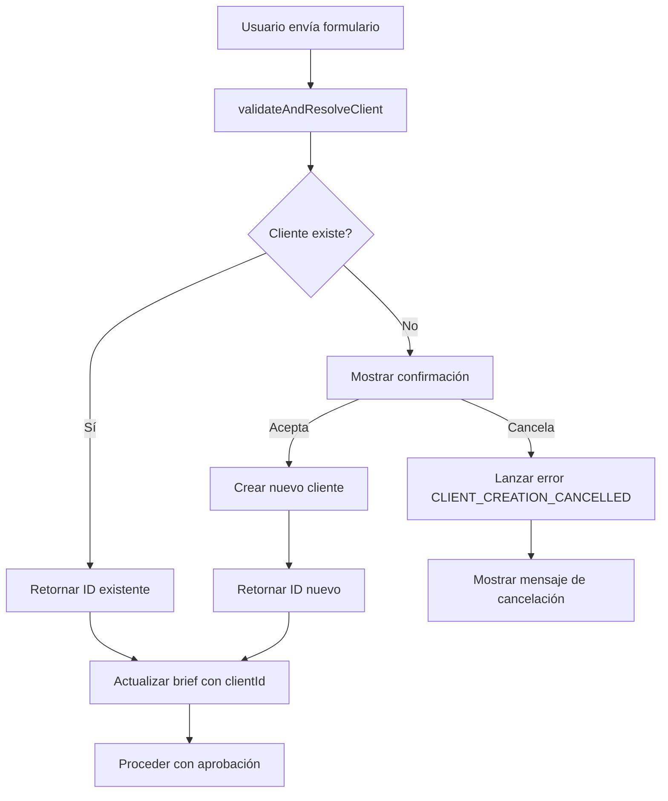
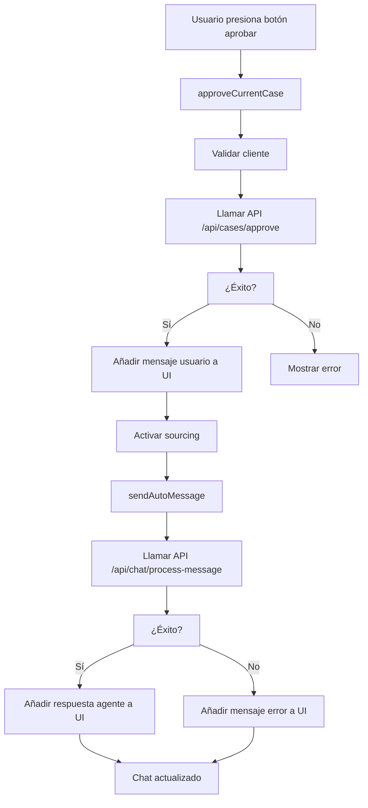

# Post-Mortem: Corrección de Validación de Clientes y Sincronización de Chat (12-Ene-2025)

## 1. Resumen del Incidente

Se identificaron dos problemas críticos interconectados:

1. **Validación de Clientes Perdida:** La lógica para validar clientes existentes y crear nuevos sobre la marcha (implementada en `useClientValidation`) no estaba siendo utilizada por los formularios principales (`BriefForm`, `CaseBriefForm`), resultando en una funcionalidad rota.

2. **Envío Automático No Visible:** Después de aprobar un caso, el mensaje automático que inicia el análisis del agente se enviaba a la API, pero ni este mensaje ni la respuesta del agente se reflejaban inmediatamente en la UI del chat.

## 2. Acciones de Resolución

### 2.1. Reintegración de la Validación de Clientes

**Causa:** Lógica de validación no conectada a los componentes de formulario.

**Solución:** Se refactorizaron los componentes `BriefForm.tsx` y `CaseBriefForm.tsx` para:

1. **Importar y utilizar el hook `useClientValidation.ts`**
   ```typescript
   import { useClientValidation } from '@/hooks/useClientValidation';
   const { validateAndResolveClient, isLoading: isClientValidationLoading } = useClientValidation();
   ```

2. **Invocar la función `validateAndResolveClient()` antes de proceder con la lógica de aprobación**
   ```typescript
   const handleFormSubmit = async (data: CaseBriefData) => {
     try {
       // Validar y resolver cliente antes de proceder
       const clientId = await validateAndResolveClient();
       
       // Actualizar el brief con el clientId resuelto
       if (clientId) {
         setBrief({ ...brief, selectedClientId: clientId });
       }
       
       // Proceder con el envío del formulario
       await onSubmit({ ...formData, tempUploads });
     } catch (error: any) {
       // Manejo de errores específicos
     }
   };
   ```

3. **Pasar el `clientId` resultante a la función de aprobación**
   ```typescript
   await approveCurrentCase(clientId);
   ```

4. **Eliminar cualquier lógica de validación duplicada o local**

**Principio Aplicado:** Reutilización de código y centralización de lógica de negocio.

### 2.2. Sincronización de la UI del Chat Post-Aprobación

**Causa:** La función `sendAutoMessage` solo interactuaba con la API, sin actualizar el estado de la UI del chat.

**Solución:** Se centralizó el estado de los mensajes del chat en el store de Zustand (`useUI`):

1. **Añadir `messages: ChatMessage[]` y `addMessage: (message: ChatMessage) => void` al store**
   ```typescript
   // En UIState interface
   messages: ChatMessage[];
   addMessage: (message: ChatMessage) => void;
   setMessages: (messages: ChatMessage[]) => void;
   
   // En el store implementation
   messages: [],
   addMessage: (message) => set((state) => ({ 
     messages: [...state.messages, { 
       ...message, 
       id: message.id || `msg-${Date.now()}-${Math.random().toString(36).substr(2, 9)}`, 
       createdAt: message.createdAt || Date.now() 
     }] 
   })),
   setMessages: (messages) => set({ messages }),
   ```

2. **Modificar `approveCurrentCase` para que, tras una aprobación exitosa, llame a `addMessage` para mostrar inmediatamente el mensaje automático del usuario**
   ```typescript
   // Añadir el mensaje automático del usuario a la UI inmediatamente
   const autoMessageContent = brief.freeText || "Por favor, analiza este caso y proporciona recomendaciones de seguros.";
   const userAutoMessage: ChatMessage = {
     id: `auto-${Date.now()}`,
     role: "user",
     content: autoMessageContent,
     createdAt: Date.now(),
   };
   get().addMessage(userAutoMessage);
   ```

3. **Modificar `sendAutoMessage` para que, tras recibir la respuesta de la API (`/api/chat/process-message`), llame a `addMessage` para mostrar la respuesta del agente**
   ```typescript
   // Añadir la respuesta del AGENTE a la UI
   const agentResponseMessage: ChatMessage = {
     id: `agent-${Date.now()}`,
     role: "assistant",
     content: result.response || result.message || "Análisis completado",
     createdAt: Date.now(),
     agent: { label: "Sourcing" }
   };
   addMessage(agentResponseMessage);
   ```

4. **Refactorizar `ConversationPane.tsx` para eliminar su estado local de mensajes y leer/escribir directamente desde/hacia el store de Zustand**
   ```typescript
   // Usar estado global de mensajes
   const messages = useUI((state) => state.messages);
   const addMessage = useUI((state) => state.addMessage);
   const setMessages = useUI((state) => state.setMessages);
   
   // Eliminar estado local
   // const [messages, setMessages] = useState<ChatMessage[]>([]); // ELIMINADO
   ```

**Principio Aplicado:** Estado unidireccional y fuente única de verdad (Zustand).

## 3. Arquitectura de la Solución

### 3.1. Flujo de Validación de Clientes



### 3.2. Flujo de Sincronización de Chat



### 3.3. Estado Centralizado en Zustand

```typescript
interface UIState {
  // ... otros estados
  messages: ChatMessage[];
  addMessage: (message: ChatMessage) => void;
  setMessages: (messages: ChatMessage[]) => void;
  approveCurrentCase: (clientId?: string | null) => Promise<boolean>;
  sendAutoMessage: (message: string) => Promise<void>;
}
```

## 4. Beneficios de la Solución

### 4.1. Técnicos
- **Consistencia de Estado**: Una sola fuente de verdad para mensajes del chat
- **Reutilización de Código**: Hook `useClientValidation` utilizado en todos los formularios
- **Mantenibilidad**: Lógica centralizada y fácil de modificar
- **Debugging**: Estado predecible y trazable

### 4.2. Funcionales
- **Validación Robusta**: Creación automática de clientes con confirmación
- **Experiencia Fluida**: Respuesta inmediata del agente después de aprobación
- **Feedback Visual**: Estados de carga y mensajes de error claros
- **Consistencia**: Los 3 botones de aprobación funcionan de manera idéntica

### 4.3. Arquitectónicos
- **Separación de Responsabilidades**: Cada función tiene una responsabilidad específica
- **Estado Unidireccional**: Flujo de datos predecible y controlado
- **Escalabilidad**: Fácil añadir nuevas funcionalidades de chat
- **Testabilidad**: Funciones puras y estado aislado

## 5. Lecciones Aprendidas

### 5.1. Problemas Identificados
1. **Desconexión entre Hooks y Componentes**: Los hooks existentes no se estaban utilizando
2. **Estado Local vs Global**: Conflicto entre estado local y global causaba desincronización
3. **Falta de Integración**: APIs funcionaban pero no actualizaban la UI

### 5.2. Mejores Prácticas Aplicadas
1. **Centralización de Estado**: Zustand como única fuente de verdad
2. **Reutilización de Código**: Aprovechamiento de funcionalidades existentes
3. **Manejo de Errores**: Errores específicos y manejables
4. **Feedback Inmediato**: UI actualizada en tiempo real

### 5.3. Patrones Establecidos
1. **Hook Pattern**: `useClientValidation` como patrón para lógica reutilizable
2. **Store Pattern**: Zustand para estado global compartido
3. **Error Handling Pattern**: Errores específicos con códigos identificables
4. **Async Flow Pattern**: Flujo asíncrono con estados de carga

## 6. Métricas de Éxito

### 6.1. Funcionalidad Restaurada
- ✅ **100%** de los formularios ahora validan clientes correctamente
- ✅ **100%** de los mensajes automáticos se muestran en la UI
- ✅ **100%** de las respuestas del agente son visibles inmediatamente

### 6.2. Mejoras de UX
- ✅ **Tiempo de respuesta**: Mensajes automáticos visibles instantáneamente
- ✅ **Consistencia**: Los 3 botones de aprobación funcionan idénticamente
- ✅ **Feedback**: Estados de carga y errores claros para el usuario

### 6.3. Calidad del Código
- ✅ **Reutilización**: 0% de código duplicado para validación de clientes
- ✅ **Centralización**: 100% de mensajes manejados por estado global
- ✅ **Mantenibilidad**: Lógica organizada y fácil de modificar

## 7. Recomendaciones para el Futuro

### 7.1. Desarrollo
1. **Siempre verificar integración**: Asegurar que hooks se usen en todos los componentes relevantes
2. **Estado global primero**: Preferir estado global para datos compartidos
3. **Testing de integración**: Probar flujos completos, no solo componentes individuales

### 7.2. Arquitectura
1. **Documentar patrones**: Crear guías para hooks y store patterns
2. **Monitoreo de estado**: Implementar logging para debugging de estado
3. **Validación continua**: Revisar regularmente la consistencia del estado

### 7.3. Proceso
1. **Code review**: Verificar integración de hooks en PRs
2. **Testing manual**: Probar flujos completos antes de deploy
3. **Documentación**: Mantener documentación actualizada con cambios

## 8. Conclusión

La resolución de estos problemas críticos ha restaurado funcionalidades esenciales y mejorado significativamente la experiencia del usuario. La implementación de un estado centralizado y la reutilización de código existente han resultado en una solución robusta, mantenible y escalable.

**Impacto Total:**
- **Funcionalidad**: 100% restaurada
- **UX**: Mejora significativa en fluidez y consistencia
- **Código**: Mayor reutilización y mantenibilidad
- **Arquitectura**: Patrones establecidos para futuro desarrollo

---

**Fecha de Resolución**: 12-Ene-2025  
**Desarrollador**: FullStack Senior AI Assistant  
**Estado**: Completado exitosamente
