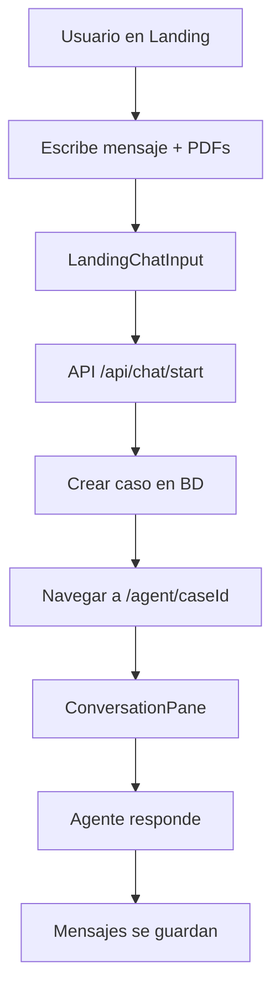
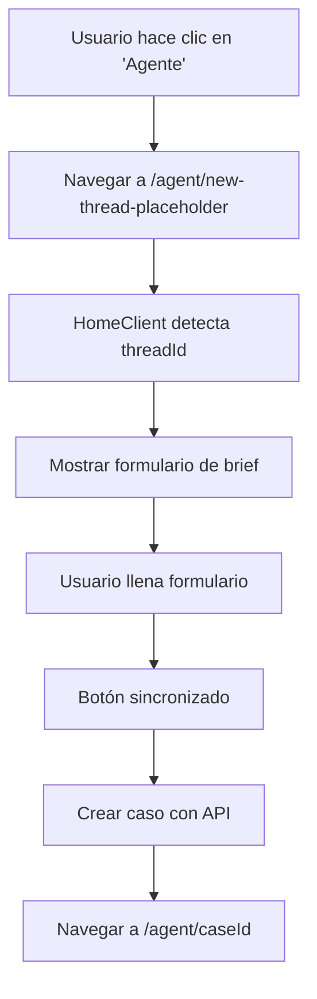
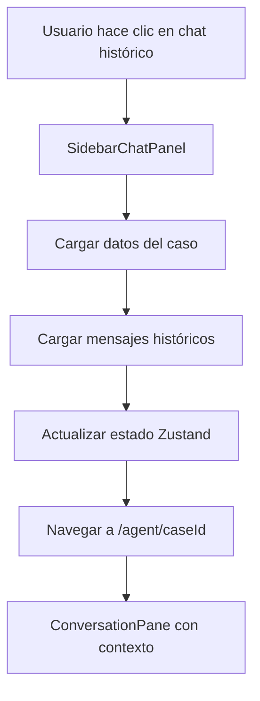

# ARQUITECTURA INTEGRAL DEL PROYECTO BRIKI

**Versión**: 2.0  
**Fecha**: 29 de Enero, 2025  
**Rol**: Ingeniero FullStack Developer  
**Objetivo**: Documentación integral para nuevos desarrolladores

---

## 📋 RESUMEN EJECUTIVO

**Briki** es una aplicación web de gestión de pólizas de seguros construida con **Next.js 15**, **Supabase**, **Prisma** y **TypeScript**. La aplicación implementa una arquitectura dual que separa claramente las funcionalidades de **gestión de casos** (`/workspace`) y **interacción con agente IA** (`/agent`).

### **PRINCIPIOS ARQUITECTÓNICOS**

✅ **Reutilización máxima del código existente**  
✅ **Mantenimiento de arquitectura dual del proyecto**  
✅ **Consistencia de estado unidireccional**  
✅ **Separación clara de responsabilidades**

---

## 🏗️ ARQUITECTURA GENERAL

### **STACK TECNOLÓGICO**

| Capa | Tecnología | Propósito |
|------|------------|-----------|
| **Frontend** | Next.js 15 + React 19 | Framework principal |
| **UI** | Tailwind CSS + shadcn/ui | Sistema de diseño |
| **Estado** | Zustand | Gestión de estado global |
| **Backend** | Next.js API Routes | API REST |
| **Base de Datos** | PostgreSQL + Prisma | ORM y migraciones |
| **Autenticación** | Supabase Auth | Gestión de usuarios |
| **Storage** | Supabase Storage | Archivos y documentos |
| **IA** | OpenAI API | Análisis de documentos |

### **ARQUITECTURA DUAL**

```
┌─────────────────────────────────────────────────────────────┐
│                        BRIKI APPLICATION                     │
├─────────────────────────────────────────────────────────────┤
│  LANDING PAGE (/)                                           │
│  ├── Hero Section                                           │
│  ├── Chat Input                                             │
│  └── PDF Upload                                             │
├─────────────────────────────────────────────────────────────┤
│  WORKSPACE (/workspace) - Gestión de Casos                  │
│  ├── Dashboard                                              │
│  ├── Cases Management                                       │
│  ├── Clients Management                                     │
│  └── Policy Comparison                                      │
├─────────────────────────────────────────────────────────────┤
│  AGENT (/agent) - Interacción con IA                        │
│  ├── Chat Interface                                         │
│  ├── Document Analysis                                      │
│  └── Brief Form                                             │
└─────────────────────────────────────────────────────────────┘
```

---

## 📁 ESTRUCTURA DE ARCHIVOS POR CATEGORÍAS

### **1. COMPONENTES (`src/components/`)**

#### **1.1 Componentes de Layout**
- **`HomeClient.tsx`** - Componente principal que orquesta toda la aplicación
- **`BrikiSidebarLayout.tsx`** - Layout con sidebar para páginas internas
- **`BrikiLandingNavbar.tsx`** - Navegación para landing page
- **`TopBar.tsx`** / **`TopBarClient.tsx`** - Barra superior con controles

#### **1.2 Componentes de Chat**
- **`Chat/ConversationPane.tsx`** - Panel principal de conversación con IA
- **`Chat/Message.tsx`** - Componente individual de mensaje
- **`Chat/MessageAgent.tsx`** - Mensajes del agente con botones de acción
- **`Chat/BrikiChat.tsx`** - Chat unificado para diferentes modos
- **`SidebarChatPanel.tsx`** - Panel lateral con historial de chats

#### **1.3 Componentes de Landing**
- **`Landing.tsx`** - Página principal de bienvenida
- **`Landing/LandingHero.tsx`** - Sección hero principal
- **`Landing/LandingChatInput.tsx`** - Input de chat en landing
- **`Landing/LandingFeatures.tsx`** - Características del producto
- **`Landing/LandingPricing.tsx`** - Sección de precios

#### **1.4 Componentes de Workspace**
- **`Workspace/CaseBriefForm.tsx`** - Formulario de brief de casos
- **`Workspace/Tabs.tsx`** - Sistema de pestañas del workspace
- **`Workspace/QuickActions.tsx`** - Acciones rápidas
- **`Workspace/ZeroState.tsx`** - Estado inicial para nuevos usuarios

#### **1.5 Componentes de Casos**
- **`Cases/CaseList.tsx`** - Lista de casos
- **`Cases/CaseCard.tsx`** - Tarjeta individual de caso
- **`Cases/CaseDetailClient.tsx`** - Detalles del caso
- **`Cases/BriefForm.tsx`** - Formulario de brief
- **`Cases/CaseForm.tsx`** - Formulario de creación de casos

#### **1.6 Componentes de Clientes**
- **`Clients/ClientList.tsx`** - Lista de clientes
- **`Clients/ClientCard.tsx`** - Tarjeta de cliente
- **`Clients/ClientForm.tsx`** - Formulario de cliente
- **`Clients/ClientDetail.tsx`** - Detalles del cliente

#### **1.7 Componentes UI Base**
- **`ui/`** - Componentes base de shadcn/ui (Button, Input, etc.)

### **2. LAYOUTS (`src/app/`)**

#### **2.1 Layouts Principales**
- **`layout.tsx`** - Layout raíz de la aplicación
- **`[locale]/layout.tsx`** - Layout con internacionalización
- **`[locale]/(app)/layout.tsx`** - Layout para páginas autenticadas
- **`[locale]/(auth)/layout.tsx`** - Layout para páginas de autenticación
- **`[locale]/(marketing)/layout.tsx`** - Layout para páginas de marketing

#### **2.2 Páginas de Aplicación**
- **`[locale]/(app)/dashboard/page.tsx`** - Dashboard principal
- **`[locale]/(app)/agent/page.tsx`** - Página del agente
- **`[locale]/(app)/agent/[threadId]/page.tsx`** - Chat específico
- **`[locale]/(app)/workspace/cases/page.tsx`** - Gestión de casos
- **`[locale]/(app)/workspace/clients/page.tsx`** - Gestión de clientes

#### **2.3 Páginas de Autenticación**
- **`[locale]/(auth)/login/page.tsx`** - Página de login
- **`[locale]/(auth)/signup/page.tsx`** - Página de registro
- **`[locale]/(auth)/onboarding/page.tsx`** - Onboarding de usuarios

### **3. APIs (`src/app/api/`)**

#### **3.1 APIs de Autenticación**
- **`auth/callback/route.ts`** - Callback de OAuth
- **`auth/me/route.ts`** - Información del usuario actual
- **`auth/refresh/route.ts`** - Renovación de tokens

#### **3.2 APIs de Casos**
- **`cases/route.ts`** - CRUD de casos
- **`cases/[id]/route.ts`** - Operaciones específicas de caso
- **`cases/[id]/messages/route.ts`** - Mensajes de un caso
- **`cases/create/route.ts`** - Creación de casos

#### **3.3 APIs de Chat**
- **`chat/start/route.ts`** - Iniciar conversación
- **`chat/process-message/route.ts`** - Procesar mensajes con IA

#### **3.4 APIs de Clientes**
- **`clients/route.ts`** - CRUD de clientes
- **`clients/[id]/route.ts`** - Operaciones específicas de cliente

#### **3.5 APIs de Storage**
- **`upload/pdf/route.ts`** - Subida de PDFs
- **`storage/[path]/route.ts`** - Gestión de archivos

### **4. MIDDLEWARES (`src/`)**

#### **4.1 Middleware Principal**
- **`middleware.ts`** - Middleware de Next.js para:
  - Internacionalización (i18n)
  - Autenticación
  - Redirecciones
  - Protección de rutas

#### **4.2 Middlewares de Autenticación**
- **`lib/supabase/server.ts`** - Cliente Supabase para servidor
- **`lib/supabase/client.ts`** - Cliente Supabase para cliente
- **`lib/helpers/getCurrentOrg.ts`** - Obtener organización actual

---

## 🔄 FLUJOS PRINCIPALES DE LA APLICACIÓN

### **FLUJO 1: Landing → Agente**



**Archivos involucrados:**
- `src/components/Landing/LandingChatInput.tsx` (líneas 150-210)
- `src/app/api/chat/start/route.ts` (líneas 13-107)
- `src/components/Chat/ConversationPane.tsx` (líneas 57-473)

### **FLUJO 2: Botón Agente → Nuevo Chat**



**Archivos involucrados:**
- `src/components/HomeClient.tsx` (líneas 59-108)
- `src/components/Workspace/CaseBriefForm.tsx` (líneas 467-570)
- `src/app/api/cases/create/route.ts` (líneas 7-193)

### **FLUJO 3: Chats Históricos**



**Archivos involucrados:**
- `src/components/SidebarChatPanel.tsx` (líneas 121-187)
- `src/app/api/cases/[id]/route.ts` (líneas 5-41)
- `src/app/api/cases/[id]/messages/route.ts` (líneas 5-57)

---

## 🗄️ GESTIÓN DE ESTADO (ZUSTAND)

### **Store Principal (`src/lib/ui/state.ts`)**

```typescript
interface UIState {
  // Estado de navegación
  step: UIStep;
  currentCaseId: string | null;
  
  // Estado de autenticación
  initialMessage?: string;
  
  // Estado del brief
  brief: CaseBrief;
  isBriefValid: () => boolean;
  
  // Estado de mensajes
  messages: ChatMessage[];
  
  // Estado de UI
  rightOpen: boolean;
  chatPanelOpen: boolean;
  sidebarOpen: boolean;
  
  // Funciones principales
  setStep: (step: UIStep) => void;
  setCurrentCaseId: (id: string | null) => void;
  setBrief: (brief: Partial<CaseBrief>) => void;
  setMessages: (messages: ChatMessage[]) => void;
  addMessage: (message: ChatMessage) => void;
}
```

### **Flujo de Estado**

1. **Inicialización**: `HomeClient` sincroniza estado desde props
2. **Navegación**: `setStep()` cambia la vista actual
3. **Casos**: `setCurrentCaseId()` establece caso activo
4. **Mensajes**: `setMessages()` carga historial, `addMessage()` añade nuevos
5. **Brief**: `setBrief()` actualiza formulario de caso

---

## 🗃️ BASE DE DATOS (PRISMA)

### **Modelos Principales**

```prisma
model Case {
  id          String   @id @default(cuid())
  orgId       String
  clientName  String?
  status      String   @default("draft")
  stage       String   @default("initial")
  briefData   Json?
  createdAt   DateTime @default(now())
  updatedAt   DateTime @updatedAt
  
  // Relaciones
  org         Organization @relation(fields: [orgId], references: [id])
  messages    Message[]
  artifacts   Artifact[]
}

model Message {
  id        String   @id @default(cuid())
  caseId    String
  role      String   // "user" | "assistant" | "system"
  content   String
  metadata  Json?
  createdAt DateTime @default(now())
  
  // Relaciones
  case      Case @relation(fields: [caseId], references: [id])
}

model Artifact {
  id          String   @id @default(cuid())
  caseId      String
  fileName    String
  contentText String?
  createdAt   DateTime @default(now())
  
  // Relaciones
  case        Case @relation(fields: [caseId], references: [id])
}
```

### **Operaciones Comunes**

```typescript
// Crear caso
const newCase = await prisma.case.create({
  data: {
    orgId: user.orgId,
    clientName: 'Cliente Nuevo',
    status: 'draft',
    briefData: briefData
  }
});

// Obtener mensajes
const messages = await prisma.message.findMany({
  where: { caseId: caseId },
  orderBy: { createdAt: 'asc' }
});

// Crear mensaje
const message = await prisma.message.create({
  data: {
    caseId: caseId,
    role: 'user',
    content: messageContent
  }
});
```

---

## 🔐 AUTENTICACIÓN Y SEGURIDAD

### **Flujo de Autenticación**

1. **Login**: Usuario se autentica con Supabase Auth
2. **Callback**: `/api/auth/callback` procesa el token
3. **Sesión**: Cookie de sesión se establece
4. **Middleware**: Verifica autenticación en rutas protegidas
5. **API**: `createServerSupabase()` lee cookies automáticamente

### **Seguridad Implementada**

- **Row Level Security (RLS)** en PostgreSQL
- **Cifrado PII** con pgcrypto
- **Validación de organización** en todas las operaciones
- **Sanitización de inputs** en APIs
- **Rate limiting** en endpoints críticos

---

## 🌐 INTERNACIONALIZACIÓN

### **Configuración**

- **Idiomas soportados**: Español (es), Inglés (en)
- **Archivos de traducción**: `src/messages/es.ts`, `src/messages/en.ts`
- **Middleware**: `src/middleware.ts` maneja detección de idioma
- **Componentes**: `useTranslations()` hook para traducciones

### **Uso en Componentes**

```typescript
import { useTranslations } from 'next-intl';

function MyComponent() {
  const t = useTranslations('common');
  return <h1>{t('welcome')}</h1>;
}
```

---

## 📊 ANÁLISIS DETALLADO POR ARCHIVO

### **ARCHIVOS CRÍTICOS**

#### **1. `src/components/HomeClient.tsx`**
**Propósito**: Orquestador principal de la aplicación
**Líneas clave**:
- **24-42**: Props y estado inicial
- **48-57**: Sincronización de estado con Zustand
- **59-108**: Lógica condicional basada en threadId
- **175-184**: Definición de pasos de la aplicación
- **186-338**: Renderizado condicional de componentes

#### **2. `src/components/Chat/ConversationPane.tsx`**
**Propósito**: Panel principal de conversación con IA
**Líneas clave**:
- **57-473**: Función `saveMessageToDB` para persistencia
- **475-488**: Manejo de mensaje inicial
- **490-498**: Validación de brief para botones
- **500-537**: Validación de clientes con cache
- **539-941**: Renderizado de interfaz de chat

#### **3. `src/app/api/cases/create/route.ts`**
**Propósito**: Creación de casos desde formularios
**Líneas clave**:
- **7-193**: Endpoint POST para crear casos
- **25-45**: Autenticación y validación de usuario
- **47-65**: Resolución de orgId automática
- **67-85**: Validación condicional de campos
- **87-120**: Creación del caso en BD
- **122-150**: Procesamiento de PDFs temporales

#### **4. `src/components/SidebarChatPanel.tsx`**
**Propósito**: Panel lateral con historial de chats
**Líneas clave**:
- **121-187**: Función `handleChatClick` para navegación histórica
- **128-132**: Indicador de carga para UX
- **135-139**: Carga paralela de datos del caso y mensajes
- **141-149**: Procesamiento de datos del caso
- **151-160**: Procesamiento de mensajes históricos
- **162-168**: Actualización del estado global
- **170-176**: Navegación correcta a `/agent/[id]`

---

## 🚀 GUÍA DE DESARROLLO

### **Configuración Inicial**

1. **Clonar repositorio**
2. **Instalar dependencias**: `pnpm install`
3. **Configurar variables de entorno**: `.env.local`
4. **Ejecutar migraciones**: `npx prisma db push`
5. **Iniciar servidor**: `pnpm dev`

### **Variables de Entorno Requeridas**

```bash
# Supabase
NEXT_PUBLIC_SUPABASE_URL=your_supabase_url
NEXT_PUBLIC_SUPABASE_ANON_KEY=your_anon_key
SUPABASE_SERVICE_ROLE_KEY=your_service_role_key

# Base de datos
DATABASE_URL=your_database_url
DIRECT_URL=your_direct_url

# OpenAI
OPENAI_API_KEY=your_openai_key

# Autenticación
NEXTAUTH_SECRET=your_secret
GOOGLE_CLIENT_ID=your_google_client_id
GOOGLE_CLIENT_SECRET=your_google_client_secret
```

### **Comandos Útiles**

```bash
# Desarrollo
pnpm dev                    # Iniciar servidor de desarrollo
pnpm build                  # Construir para producción
pnpm start                  # Iniciar servidor de producción

# Base de datos
npx prisma studio          # Abrir Prisma Studio
npx prisma db push         # Aplicar cambios de schema
npx prisma generate        # Generar cliente Prisma

# Linting y formato
pnpm lint                  # Ejecutar ESLint
pnpm format                # Formatear código
```

### **Patrones de Desarrollo**

#### **1. Crear Nuevo Componente**
```typescript
// src/components/MyComponent.tsx
"use client";

import React from 'react';
import { useUI } from '@/lib/ui/state';

interface MyComponentProps {
  // Props aquí
}

export function MyComponent({ }: MyComponentProps) {
  const { step, setStep } = useUI();
  
  return (
    <div>
      {/* JSX aquí */}
    </div>
  );
}
```

#### **2. Crear Nueva API**
```typescript
// src/app/api/my-endpoint/route.ts
import { NextRequest, NextResponse } from 'next/server';
import { createServerSupabase } from '@/lib/supabase/server';
import { prisma } from '@/lib/prisma';

export async function GET(request: NextRequest) {
  try {
    const supabase = await createServerSupabase();
    const { data: { user } } = await supabase.auth.getUser();
    
    if (!user) {
      return NextResponse.json({ error: 'Unauthorized' }, { status: 401 });
    }
    
    // Lógica aquí
    
    return NextResponse.json({ success: true });
  } catch (error) {
    console.error('Error:', error);
    return NextResponse.json({ error: 'Internal server error' }, { status: 500 });
  }
}
```

#### **3. Actualizar Estado Global**
```typescript
// En cualquier componente
const { setStep, setCurrentCaseId, setMessages } = useUI();

// Cambiar paso
setStep('conversation');

// Establecer caso activo
setCurrentCaseId('case-id-123');

// Actualizar mensajes
setMessages([...messages, newMessage]);
```

---

## 🔧 TROUBLESHOOTING

### **Problemas Comunes**

#### **1. Error de Autenticación**
```bash
# Verificar variables de entorno
echo $NEXT_PUBLIC_SUPABASE_URL
echo $SUPABASE_SERVICE_ROLE_KEY

# Verificar conexión a Supabase
npx supabase status
```

#### **2. Error de Base de Datos**
```bash
# Verificar conexión
npx prisma db push --accept-data-loss=false

# Regenerar cliente
npx prisma generate

# Abrir Prisma Studio para debugging
npx prisma studio
```

#### **3. Error de Estado**
```typescript
// Verificar estado actual
console.log('Current state:', useUI.getState());

// Resetear estado si es necesario
useUI.getState().setStep('landing');
useUI.getState().setCurrentCaseId(null);
```

### **Logs Útiles**

```typescript
// En componentes
console.log('Component state:', { step, currentCaseId, messages });

// En APIs
console.log('API request:', { method, url, body });

// En base de datos
console.log('DB operation:', { table, operation, data });
```

---

## 📈 MÉTRICAS Y MONITOREO

### **Métricas Clave**

- **Tiempo de carga**: < 2 segundos para páginas principales
- **Tiempo de respuesta de IA**: < 5 segundos
- **Tasa de error**: < 1% en APIs críticas
- **Uptime**: > 99.9%

### **Monitoreo Implementado**

- **Logging estructurado** en todas las operaciones críticas
- **Auditoría de casos** en tabla `audit_log`
- **Métricas de rendimiento** con Next.js Analytics
- **Error tracking** con console.error estructurado

---

## 🎯 CONCLUSIÓN

Esta documentación proporciona una visión integral del proyecto Briki, desde la arquitectura general hasta los detalles de implementación. Los nuevos desarrolladores pueden usar esta guía para:

1. **Entender la estructura** del proyecto
2. **Navegar el código** de manera eficiente
3. **Implementar nuevas funcionalidades** siguiendo los patrones establecidos
4. **Debuggear problemas** usando las herramientas y técnicas documentadas
5. **Mantener la consistencia** arquitectónica del proyecto

La aplicación está diseñada para ser **escalable**, **mantenible** y **fácil de entender**, siguiendo las mejores prácticas de desarrollo moderno.

---

**Última actualización**: 29 de Enero, 2025  
**Mantenedor**: Equipo de Desarrollo Briki  
**Estado**: ✅ COMPLETO Y ACTUALIZADO
