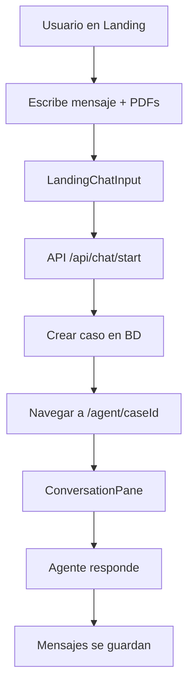
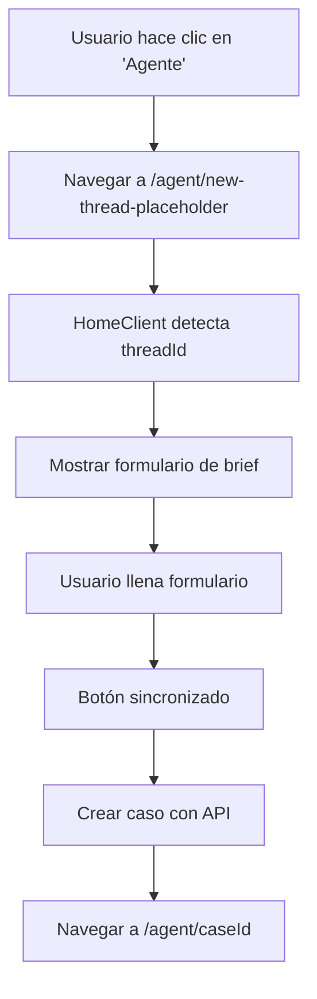
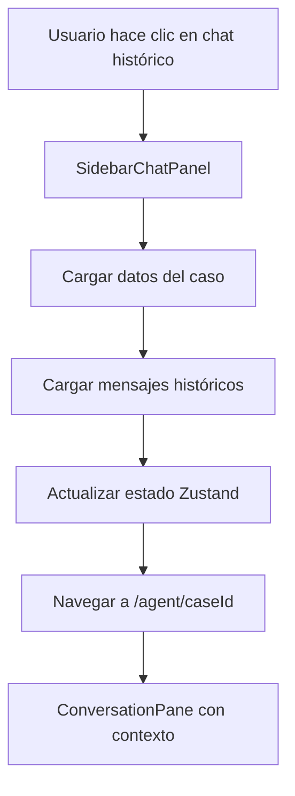

# ARQUITECTURA INTEGRAL DEL PROYECTO BRIKI

**Versión**: 2.0  
**Fecha**: 29 de Enero, 2025  
**Rol**: Ingeniero FullStack Developer  
**Objetivo**: Documentación integral para nuevos desarrolladores

---

## 📋 RESUMEN EJECUTIVO

**Briki** es una aplicación web de gestión de pólizas de seguros construida con **Next.js 15**, **Supabase**, **Prisma** y **TypeScript**. La aplicación implementa una arquitectura dual que separa claramente las funcionalidades de **gestión de casos** (`/workspace`) y **interacción con agente IA** (`/agent`).

### **PRINCIPIOS ARQUITECTÓNICOS**

✅ **Reutilización máxima del código existente**  
✅ **Mantenimiento de arquitectura dual del proyecto**  
✅ **Consistencia de estado unidireccional**  
✅ **Separación clara de responsabilidades**

---

## 🏗️ ARQUITECTURA GENERAL

### **STACK TECNOLÓGICO**

| Capa | Tecnología | Propósito |
|------|------------|-----------|
| **Frontend** | Next.js 15 + React 19 | Framework principal |
| **UI** | Tailwind CSS + shadcn/ui | Sistema de diseño |
| **Estado** | Zustand | Gestión de estado global |
| **Backend** | Next.js API Routes | API REST |
| **Base de Datos** | PostgreSQL + Prisma | ORM y migraciones |
| **Autenticación** | Supabase Auth | Gestión de usuarios |
| **Storage** | Supabase Storage | Archivos y documentos |
| **IA** | OpenAI API | Análisis de documentos |

### **ARQUITECTURA DUAL**

```
┌─────────────────────────────────────────────────────────────┐
│                        BRIKI APPLICATION                     │
├─────────────────────────────────────────────────────────────┤
│  LANDING PAGE (/)                                           │
│  ├── Hero Section                                           │
│  ├── Chat Input                                             │
│  └── PDF Upload                                             │
├─────────────────────────────────────────────────────────────┤
│  WORKSPACE (/workspace) - Gestión de Casos                  │
│  ├── Dashboard                                              │
│  ├── Cases Management                                       │
│  ├── Clients Management                                     │
│  └── Policy Comparison                                      │
├─────────────────────────────────────────────────────────────┤
│  AGENT (/agent) - Interacción con IA                        │
│  ├── Chat Interface                                         │
│  ├── Document Analysis                                      │
│  └── Brief Form                                             │
└─────────────────────────────────────────────────────────────┘
```

---

## 📁 ESTRUCTURA DE ARCHIVOS POR CATEGORÍAS

### **1. COMPONENTES (`src/components/`)**

#### **1.1 Componentes de Layout**
- **`HomeClient.tsx`** - Componente principal que orquesta toda la aplicación
- **`BrikiSidebarLayout.tsx`** - Layout con sidebar para páginas internas
- **`BrikiLandingNavbar.tsx`** - Navegación para landing page
- **`TopBar.tsx`** / **`TopBarClient.tsx`** - Barra superior con controles

#### **1.2 Componentes de Chat**
- **`Chat/ConversationPane.tsx`** - Panel principal de conversación con IA
- **`Chat/Message.tsx`** - Componente individual de mensaje
- **`Chat/MessageAgent.tsx`** - Mensajes del agente con botones de acción
- **`Chat/BrikiChat.tsx`** - Chat unificado para diferentes modos
- **`SidebarChatPanel.tsx`** - Panel lateral con historial de chats

#### **1.3 Componentes de Landing**
- **`Landing.tsx`** - Página principal de bienvenida
- **`Landing/LandingHero.tsx`** - Sección hero principal
- **`Landing/LandingChatInput.tsx`** - Input de chat en landing
- **`Landing/LandingFeatures.tsx`** - Características del producto
- **`Landing/LandingPricing.tsx`** - Sección de precios

#### **1.4 Componentes de Workspace**
- **`Workspace/CaseBriefForm.tsx`** - Formulario de brief de casos
- **`Workspace/Tabs.tsx`** - Sistema de pestañas del workspace
- **`Workspace/QuickActions.tsx`** - Acciones rápidas
- **`Workspace/ZeroState.tsx`** - Estado inicial para nuevos usuarios

#### **1.5 Componentes de Casos**
- **`Cases/CaseList.tsx`** - Lista de casos
- **`Cases/CaseCard.tsx`** - Tarjeta individual de caso
- **`Cases/CaseDetailClient.tsx`** - Detalles del caso
- **`Cases/BriefForm.tsx`** - Formulario de brief
- **`Cases/CaseForm.tsx`** - Formulario de creación de casos

#### **1.6 Componentes de Clientes**
- **`Clients/ClientList.tsx`** - Lista de clientes
- **`Clients/ClientCard.tsx`** - Tarjeta de cliente
- **`Clients/ClientForm.tsx`** - Formulario de cliente
- **`Clients/ClientDetail.tsx`** - Detalles del cliente

#### **1.7 Componentes UI Base**
- **`ui/`** - Componentes base de shadcn/ui (Button, Input, etc.)

### **2. LAYOUTS (`src/app/`)**

#### **2.1 Layout Raíz (`src/app/layout.tsx`)**
**Propósito**: Layout raíz de toda la aplicación Next.js

**Funcionalidad**:
- Define metadata global de la aplicación
- Configura providers globales (si los hay)
- Envuelve toda la aplicación

#### **2.2 Layout con Internacionalización (`src/app/[locale]/layout.tsx`)**
**Propósito**: Layout que maneja internacionalización y providers globales

**Estructura detallada**:
- **Líneas 1-6**: Imports
  - `Metadata` de Next.js
  - `CommandPalette` para búsqueda global
  - `I18nProvider` para traducciones
  - `Toaster` de sonner para notificaciones
  - `DevAxeClient` para desarrollo
  - `getMessages`, `setRequestLocale` de next-intl
  
- **Líneas 8-14**: Props del componente
  - `children`: Contenido de la página
  - `params`: Promise con `locale` (Next.js 15)
  
- **Líneas 15-17**: Configuración de locale
  - **Línea 15**: Extrae `locale` de params (await necesario en Next.js 15)
  - **Línea 16**: Establece locale para esta request
  - **Línea 17**: Obtiene mensajes de traducción
  
- **Líneas 19-28**: Renderizado
  - **Línea 20**: Envuelve en `I18nProvider` con locale y mensajes
  - **Línea 21**: Contenedor principal con clases de Tailwind
  - **Línea 22**: Renderiza `children` (contenido de la página)
  - **Línea 24**: `CommandPalette` para búsqueda global (Ctrl+K)
  - **Línea 25**: `Toaster` para notificaciones toast
  - **Línea 26**: `DevAxeClient` para herramientas de desarrollo

#### **2.3 Layout de Aplicación Autenticada (`src/app/[locale]/(app)/layout.tsx`)**
**Propósito**: Layout que protege rutas autenticadas y añade sidebar

**Estructura detallada**:
- **Líneas 1-5**: Imports
  - `ReactNode` de React
  - `redirect` de Next.js
  - `createServerSupabase` para autenticación
  - `BrikiSidebarLayout` para layout con sidebar
  
- **Líneas 7-10**: Props del componente
  - `children`: Contenido de la página
  - `params`: Promise con `locale` (Next.js 15)
  
- **Líneas 12-31**: Verificación de autenticación
  - **Línea 14**: Extrae `locale` de params
  - **Línea 16**: Crea cliente Supabase del servidor
  - **Líneas 19-22**: Obtiene usuario autenticado
  - **Líneas 24-30**: Si no hay usuario o hay error
    - Construye URL de login localizada
    - Añade parámetro `next` con ruta de dashboard
    - Redirige a login
  - **Líneas 33-38**: Si hay usuario, renderiza contenido
    - Envuelve en `BrikiSidebarLayout` (añade sidebar)
    - Renderiza `children` (página específica)

#### **2.4 Layout de Autenticación (`src/app/[locale]/(auth)/layout.tsx`)**
**Propósito**: Layout para páginas de login, registro, etc.

**Funcionalidad**:
- No requiere autenticación (rutas públicas)
- Layout específico para formularios de autenticación
- Puede incluir componentes como `RightPanel` para diseño

#### **2.5 Layout de Marketing (`src/app/[locale]/(marketing)/layout.tsx`)**
**Propósito**: Layout para landing page y páginas de marketing

**Funcionalidad**:
- Layout minimalista para marketing
- No incluye sidebar ni autenticación requerida
- Optimizado para SEO y conversión

#### **2.6 Páginas de Aplicación**

**Dashboard (`[locale]/(app)/dashboard/page.tsx`)**:
- Página principal después del login
- Muestra resumen de casos, clientes, estadísticas
- Usa componentes de `Workspace/`

**Agente (`[locale]/(app)/agent/page.tsx` y `[locale]/(app)/agent/[threadId]/page.tsx`)**:
- **`page.tsx`**: Página principal del agente (lista de chats o nuevo chat)
- **`[threadId]/page.tsx`**: Página específica de un chat
  - Si `threadId === 'new-thread-placeholder'`: Muestra formulario limpio
  - Si `threadId` es caseId: Carga caso histórico y mensajes
  - Renderiza `HomeClient` con `threadId` como prop

**Workspace - Casos (`[locale]/(app)/workspace/cases/page.tsx`)**:
- Lista de todos los casos de la organización
- Filtros, búsqueda, ordenamiento
- Navegación a detalles de caso

**Workspace - Clientes (`[locale]/(app)/workspace/clients/page.tsx`)**:
- Lista de todos los clientes de la organización
- CRUD de clientes
- Navegación a detalles de cliente

**Workspace - Tabs (`src/components/Workspace/Tabs.tsx`)**:
- Sistema de tabs para gestión de casos dentro del workspace
- **Tabs disponibles**:
  - `case-brief`: Formulario/resumen del caso
  - `policies`: Visualización de pólizas
  - `comparisons`: Comparación de pólizas con pesos ajustables
  - `proposal`: Generación de propuestas
  - `compliance`: Verificación de cumplimiento
  - `renewals`: Gestión de renovaciones
- Cada tab carga datos del caso activo (`currentCaseId`)
- Sincronización con estado global de Zustand

#### **2.7 Páginas de Autenticación**

**Login (`[locale]/(auth)/login/page.tsx`)**:
- Formulario de login con email/password
- Integración con Supabase Auth
- Redirección post-login según parámetro `next`

**Registro (`[locale]/(auth)/register/page.tsx`)**:
- Formulario de registro
- Validación de email y password
- Creación de usuario en Supabase Auth

**Actualizar Password (`[locale]/(auth)/update-password/page.tsx`)**:
- Formulario para actualizar contraseña
- Requiere token de reset válido

### **3. APIs (`src/app/api/`)**

#### **3.1 APIs de Autenticación**
- **`/auth/callback`** - Callback de OAuth (manejado por `src/app/auth/callback/route.ts`)
- **`auth/me/route.ts`** - Información del usuario actual
- **`auth/refresh/route.ts`** - Renovación de tokens

#### **3.2 APIs de Casos**
- **`cases/route.ts`** - CRUD de casos
- **`cases/[id]/route.ts`** - Operaciones específicas de caso
- **`cases/[id]/messages/route.ts`** - Mensajes de un caso
- **`cases/create/route.ts`** - Creación de casos

#### **3.3 APIs de Chat**
- **`chat/start/route.ts`** - Iniciar conversación
- **`chat/process-message/route.ts`** - Procesar mensajes con IA

#### **3.4 APIs de Clientes**
- **`clients/route.ts`** - CRUD de clientes
- **`clients/[id]/route.ts`** - Operaciones específicas de cliente

#### **3.5 APIs de Storage**
- **`upload/pdf/route.ts`** - Subida de PDFs
- **`storage/[path]/route.ts`** - Gestión de archivos

### **4. MIDDLEWARES (`src/`)**

#### **4.1 Middleware Principal (`src/middleware.ts`)**
**Propósito**: Middleware de Next.js que maneja internacionalización, autenticación y protección de rutas

**Estructura detallada**:
- **Líneas 1-5**: Imports
  - `createMiddleware` de `next-intl` para i18n
  - `createServerClient` de `@supabase/ssr` para autenticación
  - `NextRequest`, `NextResponse` de Next.js
  - `env` para variables de entorno
  - `getDashboardHome` para redirecciones localizadas
  
- **Líneas 7-12**: Configuración de i18n
  - Idiomas soportados: `['en', 'es']`
  - Idioma por defecto: `'es'`
  - `localePrefix: 'as-needed'`: Solo añade prefijo cuando es necesario
  - `localeDetection: true`: Detecta idioma automáticamente
  
- **Líneas 14-23**: Inicialización del middleware
  - **Línea 15**: Ejecuta middleware de i18n primero
  - **Línea 16**: Extrae `pathname` de la URL
  - **Línea 19**: Remueve prefijo de locale para verificar ruta real
  - **Líneas 22-23**: Extrae locale de la ruta (es/en) o usa 'es' por defecto
  
- **Líneas 25-26**: Parámetro de bypass
  - `?landing=1` permite acceder a landing aunque esté autenticado
  
- **Líneas 28-38**: Rutas públicas
  - Define array de rutas siempre accesibles: `/`, `/landing`, `/login`, `/register`, `/auth/*`
  
- **Líneas 40-43**: Verificación de ruta pública
  - Verifica si la ruta actual es pública (con o sin prefijo de locale)
  
- **Líneas 45-82**: Manejo de rutas públicas
  - **Líneas 46-79**: Si es ruta pública
    - **Líneas 48-78**: Si es ruta raíz (`/`) y no hay bypass
      - Crea cliente Supabase para verificar autenticación
      - **Líneas 52-68**: Configura cookies para Supabase SSR
      - **Líneas 70-72**: Obtiene usuario autenticado
      - **Líneas 74-78**: Si está autenticado, redirige a dashboard
    - **Línea 81**: Retorna response (permite acceso)
  
- **Líneas 84-91**: Verificación de rutas protegidas
  - Define regex para rutas protegidas: `/profile`, `/dashboard`, `/workspace`, `/agent`, `/settings`
  - Si no es ruta protegida, permite acceso
  
- **Líneas 93-123**: Protección de rutas autenticadas
  - **Líneas 94-110**: Crea cliente Supabase para verificar sesión
    - Configura cookies para leer/escribir sesión
  - **Líneas 112-114**: Obtiene usuario autenticado
  - **Líneas 116-121**: Si no hay usuario, redirige a login
    - Añade parámetro `next` con ruta original para redirección post-login
  - **Línea 123**: Si hay usuario, permite acceso
  
- **Líneas 126-134**: Configuración del matcher
  - Excluye rutas de API, assets estáticos, favicons, etc.
  - Solo procesa rutas de páginas

#### **4.2 Cliente Supabase para Servidor (`src/lib/supabase/server.ts`)**
**Propósito**: Crea cliente Supabase configurado para Server Components y API Routes

**Estructura detallada**:
- **Líneas 1-3**: Imports
  - `createServerClient` de `@supabase/ssr`
  - `cookies` de `next/headers` (Next.js 15)
  - `env` para variables de entorno
  
- **Líneas 5-46**: Función `createServerSupabase()`
  - **Línea 6**: Obtiene cookie store de Next.js (async en Next.js 15)
  - **Líneas 8-45**: Crea cliente Supabase con configuración SSR
    - **Líneas 9-10**: URLs y keys desde variables de entorno
    - **Líneas 12-27**: Configuración de cookies
      - `getAll()`: Lee todas las cookies del request
      - `setAll()`: Escribe cookies en la response
        - Maneja errores silenciosamente (cookies pueden estar en middleware)
    - **Líneas 28-34**: Configuración de auth
      - `persistSession: true`: Mantiene sesión en cookies
      - `autoRefreshToken: true`: Refresca tokens automáticamente
      - `detectSessionInUrl: false`: No detecta sesión en URL (usa cookies)
    - **Líneas 35-40**: Headers globales
      - Añade `X-Client-Info` para identificación
    - **Líneas 41-43**: Configuración de BD
      - Schema por defecto: `'public'`
  - **Línea 45**: Retorna cliente configurado

#### **4.3 Cliente Supabase para Cliente (`src/lib/supabase/client.ts`)**
**Propósito**: Crea cliente Supabase configurado para Client Components

**Estructura detallada**:
- **Líneas 1-5**: Imports y variables de entorno
  - `createBrowserClient` de `@supabase/ssr`
  - Lee `NEXT_PUBLIC_SUPABASE_URL` y `NEXT_PUBLIC_SUPABASE_ANON_KEY`
  
- **Líneas 8-19**: Validación en desarrollo
  - Si `NODE_ENV === 'development'`, valida que las variables existan
  - Lanza error descriptivo si faltan
  
- **Líneas 22-24**: Validación en producción
  - Valida que las variables existan (runtime)
  - Lanza error si no están configuradas
  
- **Línea 26**: Singleton del cliente
  - `browserClient`: Variable global para reutilizar instancia
  
- **Líneas 28-34**: Función `createBrowserSupabase()`
  - **Líneas 29-31**: Si no existe cliente, crea uno nuevo
    - Usa `createBrowserClient` con URLs y keys
  - **Línea 33**: Retorna cliente (reutiliza si ya existe)

#### **4.4 Helper de Organización (`src/lib/helpers/getCurrentOrg.ts`)**
**Propósito**: Obtiene la organización actual del usuario autenticado

**Funcionalidad**:
- Obtiene usuario autenticado con `createServerSupabase()`
- Busca membresía del usuario en `org_members`
- Retorna objeto con `user` y `currentOrg`
- Lanza error si usuario no está autenticado o no tiene organización

---

## 🔄 FLUJOS PRINCIPALES DE LA APLICACIÓN

### **FLUJO 1: Landing → Agente**



**Archivos involucrados:**
- `src/components/Landing/LandingChatInput.tsx` (líneas 150-210)
- `src/app/api/chat/start/route.ts` (líneas 13-107)
- `src/components/Chat/ConversationPane.tsx` (líneas 57-473)

### **FLUJO 2: Botón Agente → Nuevo Chat**



**Archivos involucrados:**
- `src/components/HomeClient.tsx` (líneas 59-108)
- `src/components/Workspace/CaseBriefForm.tsx` (líneas 467-570)
- `src/app/api/cases/create/route.ts` (líneas 7-193)

### **FLUJO 3: Chats Históricos**



**Archivos involucrados:**
- `src/components/SidebarChatPanel.tsx` (líneas 121-187)
- `src/app/api/cases/[id]/route.ts` (líneas 5-41)
- `src/app/api/cases/[id]/messages/route.ts` (líneas 5-57)

---

## 🗄️ GESTIÓN DE ESTADO (ZUSTAND)

### **Store Principal (`src/lib/ui/state.ts`)**

```typescript
interface UIState {
  // Estado de navegación
  step: UIStep;
  currentCaseId: string | null;
  
  // Estado de autenticación
  initialMessage?: string;
  
  // Estado del brief
  brief: CaseBrief;
  isBriefValid: () => boolean;
  
  // Estado de mensajes
  messages: ChatMessage[];
  
  // Estado de UI
  rightOpen: boolean;
  chatPanelOpen: boolean;
  sidebarOpen: boolean;
  
  // Funciones principales
  setStep: (step: UIStep) => void;
  setCurrentCaseId: (id: string | null) => void;
  setBrief: (brief: Partial<CaseBrief>) => void;
  setMessages: (messages: ChatMessage[]) => void;
  addMessage: (message: ChatMessage) => void;
}
```

### **Flujo de Estado**

1. **Inicialización**: `HomeClient` sincroniza estado desde props
2. **Navegación**: `setStep()` cambia la vista actual
3. **Casos**: `setCurrentCaseId()` establece caso activo
4. **Mensajes**: `setMessages()` carga historial, `addMessage()` añade nuevos
5. **Brief**: `setBrief()` actualiza formulario de caso

---

## 🗃️ BASE DE DATOS (PRISMA)

### **Modelos Principales**

```prisma
model Case {
  id          String   @id @default(cuid())
  orgId       String
  clientName  String?
  status      String   @default("draft")
  stage       String   @default("initial")
  briefData   Json?
  createdAt   DateTime @default(now())
  updatedAt   DateTime @updatedAt
  
  // Relaciones
  org         Organization @relation(fields: [orgId], references: [id])
  messages    Message[]
  artifacts   Artifact[]
}

model Message {
  id        String   @id @default(cuid())
  caseId    String
  role      String   // "user" | "assistant" | "system"
  content   String
  metadata  Json?
  createdAt DateTime @default(now())
  
  // Relaciones
  case      Case @relation(fields: [caseId], references: [id])
}

model Artifact {
  id          String   @id @default(cuid())
  caseId      String
  fileName    String
  contentText String?
  createdAt   DateTime @default(now())
  
  // Relaciones
  case        Case @relation(fields: [caseId], references: [id])
}
```

### **Operaciones Comunes**

```typescript
// Crear caso
const newCase = await prisma.case.create({
  data: {
    orgId: user.orgId,
    clientName: 'Cliente Nuevo',
    status: 'draft',
    briefData: briefData
  }
});

// Obtener mensajes
const messages = await prisma.message.findMany({
  where: { caseId: caseId },
  orderBy: { createdAt: 'asc' }
});

// Crear mensaje
const message = await prisma.message.create({
  data: {
    caseId: caseId,
    role: 'user',
    content: messageContent
  }
});
```

---

## 🔐 AUTENTICACIÓN Y SEGURIDAD

### **Flujo de Autenticación**

1. **Login**: Usuario se autentica con Supabase Auth (client-side o server-side)
2. **Callback**: `/auth/callback` procesa el token y asegura creación de entidades (Profile, Organization, Membership)
3. **Sesión**: Cookie de sesión se establece
4. **Middleware**: Verifica autenticación en rutas protegidas
5. **API**: `createServerSupabase()` lee cookies automáticamente

### **Seguridad Implementada**

- **Row Level Security (RLS)** en PostgreSQL
- **Cifrado PII** con pgcrypto
- **Validación de organización** en todas las operaciones
- **Sanitización de inputs** en APIs
- **Rate limiting** en endpoints críticos

---

## 🌐 INTERNACIONALIZACIÓN

### **Configuración**

- **Idiomas soportados**: Español (es), Inglés (en)
- **Archivos de traducción**: `src/messages/es.ts`, `src/messages/en.ts`
- **Middleware**: `src/middleware.ts` maneja detección de idioma
- **Componentes**: `useTranslations()` hook para traducciones

### **Uso en Componentes**

```typescript
import { useTranslations } from 'next-intl';

function MyComponent() {
  const t = useTranslations('common');
  return <h1>{t('welcome')}</h1>;
}
```

---

## 📊 ANÁLISIS DETALLADO POR ARCHIVO

### **ARCHIVOS CRÍTICOS**

#### **1. `src/components/HomeClient.tsx`**
**Propósito**: Orquestador principal de la aplicación que coordina todos los componentes y flujos

**Estructura detallada**:
- **Líneas 1-18**: Imports de componentes y hooks necesarios
  - Importa `useUI` de Zustand para estado global
  - Importa componentes dinámicos (`ConversationPane`) para code-splitting
  - Importa componentes de layout (`BrikiLandingNavbar`, `WorkspaceTabs`)
  
- **Líneas 25-28**: Interface de props
  - `initialStep`: Paso inicial de la aplicación (landing, conversation, etc.)
  - `threadId`: ID del caso o 'new-thread-placeholder' para nuevos chats
  
- **Líneas 30-49**: Inicialización del componente
  - `initializedRef`: Ref para evitar inicializaciones múltiples
  - `pathname`: Obtiene ruta actual para verificación
  - `useUI()`: Obtiene estado global completo (step, currentCaseId, brief, messages, etc.)
  - `isAuthenticated`: Estado local para verificar autenticación
  
- **Líneas 52-60**: Sincronización de estado con Zustand
  - `useEffect` que sincroniza `initialStep` prop con estado global
  - Solo actualiza si `initialStep` es diferente del `step` actual
  - Evita loops infinitos excluyendo `step` de dependencias
  
- **Líneas 64-153**: Lógica condicional basada en `threadId`
  - **Si `threadId === 'new-thread-placeholder'`** (líneas 65-137):
    - Limpia estado inmediatamente: `caseApproved`, `currentCaseId`, `brief`
    - Si existe `landingDataPending`, carga datos temporalmente al brief
    - Limpia mensajes y `initialMessage` con delay de 50ms
    - Establece `step` a 'conversation'
  - **Si `threadId` es un caseId real** (líneas 138-152):
    - Establece `currentCaseId` desde `threadId`
    - Resetea `caseApproving` pero mantiene `caseApproved`
    - Establece `step` a 'conversation'
  
- **Líneas 161-186**: Verificación de autenticación
  - Se ejecuta cuando `briefingCase?.isActive` cambia
  - Hace fetch a `/api/auth/me` para verificar autenticación
  - Actualiza `isAuthenticated` y `authLoading`
  
- **Líneas 189-252**: Función `handleBriefSubmit`
  - Obtiene información del usuario autenticado
  - Si no está autenticado, redirige a `/login`
  - Crea caso con `/api/cases/create`
  - Navega a `/agent/${caseId}` después de crear
  
- **Líneas 254-338**: Renderizado condicional
  - Renderiza diferentes componentes según `currentStep`
  - Maneja estados de loading, error, y autenticación

#### **2. `src/components/Chat/ConversationPane.tsx`**
**Propósito**: Panel principal de conversación con IA que maneja envío, recepción y persistencia de mensajes

**Estructura detallada**:
- **Líneas 1-24**: Imports y tipos
  - Importa hooks de React y Zustand
  - Define tipo `ChatMessage` que extiende `BaseChatMessage` con soporte para `React.ReactNode`
  
- **Líneas 27-65**: Inicialización y estado
  - Obtiene estado global de Zustand usando selectores individuales (evita re-renders innecesarios)
  - `brief`, `isSourcing`, `initialMessage`, `currentCaseId`, `messages`
  - Estado local: `isAnalyzing`, `value` (input), `isTyping`, `showApprovalButton`
  - Cache para validaciones de clientes: `validatedClientCache`
  
- **Líneas 68-142**: Función `saveMessageToDB`
  - **Línea 69**: Obtiene `currentCaseId` del estado global
  - **Líneas 70-73**: Si no hay `currentCaseId`, omite guardado
  - **Líneas 75-76**: Configura retry con máximo 3 intentos
  - **Líneas 78-116**: Loop de reintentos
    - **Líneas 82-96**: Hace POST a `/api/cases/${currentCaseId}/messages`
    - **Líneas 98-100**: Si éxito, sale del loop
    - **Líneas 102-108**: Si error 500, reintenta con delay exponencial
    - **Líneas 110-115**: Si error del cliente (400, 404), no reintenta
  - **Líneas 117-140**: Manejo de errores de conexión (ECONNRESET)
    - Delay más largo para errores de conexión (3000ms vs 2000ms)
  
- **Líneas 144-205**: Configuración de traducciones y helpers
  - `sourcingTranslations`: Traducciones para estados de sourcing
  - `chatTranslations`: Traducciones para chat
  - Funciones helper para mostrar/ocultar hints
  
- **Líneas 207-210**: Función `isNearBottom`
  - Detecta si el scroll está cerca del final (threshold: 80px)
  - Usado para auto-scroll y mostrar botón "jump to newest"
  
- **Líneas 212-500+**: Lógica de envío de mensajes
  - **Líneas 212-250**: Función `handleSend`
    - Valida que el mensaje no esté vacío
    - Crea mensaje local y lo añade al estado
    - Guarda en BD usando `saveMessageToDB`
    - Si hay `currentCaseId`, procesa con IA
    - Si no hay `currentCaseId`, crea caso primero
  - **Líneas 250-400**: Procesamiento con IA
    - Hace POST a `/api/chat/process-message`
    - Muestra indicador de análisis (`isAnalyzing`)
    - Añade respuesta del agente al estado
    - Guarda respuesta en BD
  
- **Líneas 500-1100+**: Renderizado de UI
  - Renderiza lista de mensajes con scroll automático
  - Input de texto con validación
  - Botones de acción según estado del brief
  - Indicadores de carga y typing

#### **3. `src/app/api/cases/create/route.ts`**
**Propósito**: Endpoint API para crear casos nuevos desde formularios

**Estructura detallada**:
- **Líneas 1-5**: Imports
  - `NextRequest`, `NextResponse` de Next.js
  - `createServerSupabase` para autenticación
  - `createCaseWithOrg` para crear caso en BD
  - `recordAuditLog` para auditoría
  
- **Líneas 7-37**: Autenticación y validación inicial
  - **Línea 9**: Log de inicio de request
  - **Línea 12**: Crea cliente Supabase del servidor (lee cookies automáticamente)
  - **Líneas 15-17**: Verifica cookies disponibles (debug)
  - **Línea 19**: Obtiene usuario autenticado
  - **Líneas 21-26**: Si error de autenticación, retorna 401
  - **Líneas 29-34**: Si no hay usuario, retorna 401
  - **Línea 37**: Log de autenticación exitosa
  
- **Líneas 39-77**: Parsing y validación de `max_budget`
  - **Línea 39**: Parsea body del request
  - **Líneas 40-58**: Extrae campos del body
  - **Líneas 60-77**: Validación y normalización de `max_budget`
    - Convierte string a number si es necesario
    - Limita al rango DECIMAL(10,2): -99,999,999.99 a 99,999,999.99
    - Redondea a 2 decimales
    - Log de advertencia si se ajustó el valor
  
- **Líneas 79-99**: Resolución de `orgId`
  - **Línea 80**: Usa `orgId` proporcionado si existe
  - **Líneas 82-98**: Si no se proporciona, obtiene de membresía del usuario
    - Busca en `org_members` por `user_id`
    - Si no encuentra, retorna 403
    - Si encuentra, usa `org_id` de la membresía
  
- **Líneas 101-111**: Validación de campos requeridos
  - **Línea 102**: `clientName` opcional, usa 'Cliente Nuevo' por defecto
  - **Líneas 104-111**: Valida `insurance_category` solo si status NO es 'draft'
    - Los casos en draft pueden no tener categoría todavía
  
- **Líneas 113-126**: Verificación de membresía
  - Verifica que el usuario pertenece a la organización
  - Usa Supabase para consultar `org_members`
  - Si no pertenece, retorna 403
  
- **Líneas 128-184**: Creación del caso con retry
  - **Líneas 129-131**: Configura retry con máximo 3 intentos
  - **Líneas 133-155**: Loop de reintentos
    - **Líneas 135-154**: Llama a `createCaseWithOrg` con datos validados
    - **Líneas 156-183**: Manejo de errores de Prisma
      - Si error de conexión (P1001, P2024), reintenta
      - Si es primer intento, intenta reconexión
      - Delay exponencial entre reintentos
      - Si falla después de todos los reintentos, retorna 503
  
- **Líneas 186-204**: Registro de auditoría
  - Registra creación de caso en `audit_log`
  - No falla la request si falla la auditoría (solo loguea error)
  
- **Líneas 206-233**: Procesamiento de PDFs temporales
  - **Línea 207**: Log de cantidad de PDFs
  - **Líneas 208-232**: Loop para crear artifacts
    - Crea registro en tabla `artifacts` para cada PDF
    - Guarda `storagePath`, `fileName`, `contentText`, `provenance`
    - `sourceType` es 'pdf' (no 'upload')
  
- **Líneas 235-239**: Respuesta exitosa
  - Retorna JSON con `success: true`, `caseId`, y objeto `case` completo
  - Status 201 (Created)
  
- **Líneas 241-247**: Manejo de errores generales
  - Catch-all para errores no manejados
  - Retorna 500 con mensaje genérico

#### **4. `src/components/SidebarChatPanel.tsx`**
**Propósito**: Panel lateral que muestra historial de chats y permite navegar a casos históricos

**Estructura detallada**:
- **Líneas 135-189**: Función `handleChatClick`
  - **Línea 138**: Obtiene funciones del estado global de Zustand
  - **Línea 140**: Log de inicio de carga
  - **Líneas 142-146**: Crea indicador visual de carga (toast)
  - **Líneas 149-153**: Carga paralela de datos del caso y mensajes
    - `Promise.all` para optimizar tiempo de carga
    - Fetch a `/api/cases/${caseId}` para datos del caso
    - Fetch a `/api/cases/${caseId}/messages` para mensajes
  - **Líneas 155-163**: Procesamiento de datos del caso
    - Valida que la respuesta sea OK
    - Extrae `caseData` y `briefData`
    - Valida que `briefData` exista
  - **Líneas 165-174**: Procesamiento de mensajes históricos
    - Si respuesta OK, extrae array de mensajes
    - Si falla, loguea warning pero continúa (no bloquea)
  - **Líneas 176-188**: Actualización del estado global
    - `setCurrentCaseId(caseId)`: Establece caso activo
    - Limpia `tempUploads` del brief (PDFs vienen de artifacts, no tempUploads)
    - `setBrief(briefData)`: Carga brief histórico
    - `setMessages(historicalMessages)`: Carga mensajes históricos
    - `setStep("conversation")`: Cambia a vista de conversación
    - `closeChatPanel()`: Cierra el panel lateral
  - **Líneas 190-210**: Navegación
    - Extrae locale de la ruta actual
    - Navega a `/${locale}/agent/${caseId}`
    - Remueve indicador de carga
    - Maneja errores con toast de error

#### **5. `src/app/api/cases/[id]/messages/route.ts`**
**Propósito**: Endpoint API para obtener y crear mensajes de un caso específico

**Estructura detallada - GET (líneas 6-61)**:
- **Líneas 6-14**: Parámetros y autenticación
  - Obtiene `params` como Promise (Next.js 15)
  - Obtiene usuario y organización con `getCurrentOrg()`
  - Extrae `caseId` de params
  
- **Líneas 16-32**: Validación de acceso
  - Verifica que el caso existe Y pertenece a la organización
  - Usa `findFirst` con filtro `orgId` para RLS
  - Si no existe o no tiene acceso, retorna 404
  
- **Líneas 34-50**: Obtención de mensajes
  - Busca mensajes con `prisma.message.findMany`
  - Filtra por `caseId`
  - Ordena por `createdAt: 'asc'` (cronológico)
  - Selecciona solo campos necesarios: `id`, `role`, `content` (Buffer encriptado), `createdAt`, `metadata`
  
- **Líneas 52-56**: Desencriptación y respuesta
  - Llama a `decryptMessages()` para desencriptar todos los mensajes
  - Retorna JSON con array de mensajes desencriptados

**Estructura detallada - POST (líneas 63-170)**:
- **Líneas 63-87**: Parámetros, autenticación y validación
  - Similar a GET: obtiene usuario, org, caseId
  - Verifica que el caso pertenece a la organización
  - Parsea body: `role`, `content`, `metadata`
  - Valida que `role` y `content` existan
  
- **Líneas 95-96**: Encriptación del contenido
  - Llama a `encryptMessageContent(content)` para encriptar antes de guardar
  
- **Líneas 98-136**: Verificación de duplicados
  - Busca mensajes de los últimos 5 segundos con mismo `role`
  - Desencripta mensajes existentes para comparar contenido
  - Si encuentra duplicado, retorna el existente (no crea nuevo)
  
- **Líneas 138-153**: Creación del mensaje
  - Crea mensaje con `prisma.message.create`
  - `content: Buffer.from(encryptedContent)`: Convierte a Buffer para Prisma Bytes
  - Guarda `metadata` si existe
  
- **Líneas 155-165**: Desencriptación y respuesta
  - Desencripta el mensaje creado
  - Retorna JSON con mensaje desencriptado y flag `duplicate: false`

#### **6. `src/app/api/chat/process-message/route.ts`**
**Propósito**: Endpoint API para procesar mensajes del usuario con IA y guardar respuestas

**Estructura detallada**:
- **Líneas 1-7**: Imports
  - `createServerSupabase`, `prisma`, `getCurrentOrg`
  - `analyzeInsuranceDocuments` para análisis con OpenAI
  - `encryptMessageContent`, `decryptMessages` para encriptación
  
- **Líneas 9-21**: Autenticación y validación
  - Obtiene usuario y organización con `getCurrentOrg()`
  - Parsea body: `message`, `brief`, `caseId`
  - Valida que `caseId` exista
  
- **Líneas 22-33**: Obtención de artifacts
  - Busca documentos del caso con `prisma.artifact.findMany`
  - Filtra por `caseId` y `orgId` (seguridad)
  - Selecciona `fileName` y `contentText` para análisis
  
- **Líneas 35-43**: Preparación de request para OpenAI
  - Crea `AnalysisRequest` con mensaje, brief, y documentos
  - Mapea artifacts a formato esperado por OpenAI
  
- **Líneas 45-94**: Guardado de mensaje del usuario
  - **Líneas 49-69**: Verificación de duplicados
    - Busca mensajes de los últimos 10 segundos con `role: 'user'`
    - Desencripta para comparar contenido
  - **Líneas 75-89**: Si no existe duplicado, guarda mensaje
    - Encripta contenido con `encryptMessageContent()`
    - Crea mensaje con `prisma.message.create`
    - `content: Buffer.from(encryptedContent)`: Convierte a Buffer
  - **Líneas 91-94**: Manejo de errores (no bloquea el flujo)
  
- **Líneas 96-99**: Análisis con OpenAI
  - Llama a `analyzeInsuranceDocuments()` con request preparado
  - Obtiene respuesta del agente
  
- **Líneas 100-130**: Guardado de respuesta del agente
  - Similar a guardado de mensaje del usuario
  - Encripta respuesta antes de guardar
  - Guarda con `role: 'assistant'` y `metadata.agent: 'sourcing'`
  
- **Líneas 132-135**: Respuesta
  - Retorna JSON con `response` (análisis del agente) y `caseId`

#### **7. `src/lib/helpers/messageEncryption.ts`**
**Propósito**: Funciones helper para encriptar y desencriptar mensajes usando pgcrypto

**Estructura detallada**:
- **Líneas 26-56**: Función `encryptMessageContent()`
  - **Líneas 27-34**: Validación de `APP_ENCRYPTION_KEY`
    - Verifica que esté configurada y no sea el valor por defecto
    - Lanza error si no está configurada
  - **Líneas 38-53**: Transacción de Prisma
    - **Línea 40**: Configura `app.encryption_key` en la sesión de BD
    - **Líneas 43-45**: Ejecuta `encrypt_pii()` de PostgreSQL
    - **Línea 47**: Extrae Buffer del resultado
    - **Líneas 48-50**: Retorna Buffer directamente (compatible con Prisma Bytes)
  - **Línea 55**: Retorna Buffer encriptado
  
- **Líneas 70-107**: Función `decryptMessageContent()`
  - **Líneas 70-83**: Validación y preparación
    - Valida `APP_ENCRYPTION_KEY`
    - Si buffer vacío, retorna string vacío
    - Convierte Uint8Array a Buffer si es necesario
  - **Líneas 92-104**: Transacción de Prisma
    - Configura `app.encryption_key`
    - Ejecuta `decrypt_pii()` de PostgreSQL
    - Retorna string desencriptado
  
- **Líneas 119-170**: Función `decryptMessages()` (batch)
  - **Líneas 119-134**: Validación inicial
    - Valida `APP_ENCRYPTION_KEY`
    - Si array vacío, retorna array vacío
  - **Líneas 137-164**: Transacción de Prisma
    - Configura `app.encryption_key` una vez
    - **Líneas 141-162**: Desencripta todos los mensajes en paralelo
      - Para cada mensaje, ejecuta `decrypt_pii()`
      - Retorna mensaje con `content` desencriptado (string)
    - **Línea 164**: `Promise.all` para paralelizar desencriptación
  - **Línea 169**: Retorna array de mensajes desencriptados

#### **8. `src/lib/helpers/profileEncryption.ts`**
**Propósito**: Funciones helper para encriptar y desencriptar campos PII de profiles

**Estructura detallada**:
- **Líneas 26-55**: Función `encryptProfilePhone()`
  - Similar a `encryptMessageContent()` pero para teléfonos
  - Si `phone` es null/undefined/vacío, retorna null
  - Retorna `Buffer | null`
  
- **Líneas 69-100**: Función `decryptProfilePhone()`
  - Similar a `decryptMessageContent()` pero para teléfonos
  - Si `encrypted` es null/vacío, retorna null
  - Retorna `string | null`
  
- **Funciones similares para `address` y `name`**:
  - `encryptProfileAddress()`: Encripta dirección
  - `decryptProfileAddress()`: Desencripta dirección
  - `encryptProfileName()`: Encripta nombre
  - `decryptProfileName()`: Desencripta nombre
  - Todas siguen el mismo patrón: validación → transacción → encriptación/desencriptación

---

## 🚀 GUÍA DE DESARROLLO

### **Configuración Inicial**

1. **Clonar repositorio**
2. **Instalar dependencias**: `pnpm install`
3. **Configurar variables de entorno**: `.env.local`
4. **Ejecutar migraciones**: `npx prisma db push`
5. **Iniciar servidor**: `pnpm dev`

### **Variables de Entorno Requeridas**

```bash
# Supabase
NEXT_PUBLIC_SUPABASE_URL=your_supabase_url
NEXT_PUBLIC_SUPABASE_ANON_KEY=your_anon_key
SUPABASE_SERVICE_ROLE_KEY=your_service_role_key

# Base de datos
DATABASE_URL=your_database_url
DIRECT_URL=your_direct_url

# OpenAI
OPENAI_API_KEY=your_openai_key

# Autenticación
NEXTAUTH_SECRET=your_secret
GOOGLE_CLIENT_ID=your_google_client_id
GOOGLE_CLIENT_SECRET=your_google_client_secret
```

### **Comandos Útiles**

```bash
# Desarrollo
pnpm dev                    # Iniciar servidor de desarrollo
pnpm build                  # Construir para producción
pnpm start                  # Iniciar servidor de producción

# Base de datos
npx prisma studio          # Abrir Prisma Studio
npx prisma db push         # Aplicar cambios de schema
npx prisma generate        # Generar cliente Prisma

# Linting y formato
pnpm lint                  # Ejecutar ESLint
pnpm format                # Formatear código
```

### **Patrones de Desarrollo**

#### **1. Crear Nuevo Componente**
```typescript
// src/components/MyComponent.tsx
"use client";

import React from 'react';
import { useUI } from '@/lib/ui/state';

interface MyComponentProps {
  // Props aquí
}

export function MyComponent({ }: MyComponentProps) {
  const { step, setStep } = useUI();
  
  return (
    <div>
      {/* JSX aquí */}
    </div>
  );
}
```

#### **2. Crear Nueva API**
```typescript
// src/app/api/my-endpoint/route.ts
import { NextRequest, NextResponse } from 'next/server';
import { createServerSupabase } from '@/lib/supabase/server';
import { prisma } from '@/lib/prisma';

export async function GET(request: NextRequest) {
  try {
    const supabase = await createServerSupabase();
    const { data: { user } } = await supabase.auth.getUser();
    
    if (!user) {
      return NextResponse.json({ error: 'Unauthorized' }, { status: 401 });
    }
    
    // Lógica aquí
    
    return NextResponse.json({ success: true });
  } catch (error) {
    console.error('Error:', error);
    return NextResponse.json({ error: 'Internal server error' }, { status: 500 });
  }
}
```

#### **3. Actualizar Estado Global**
```typescript
// En cualquier componente
const { setStep, setCurrentCaseId, setMessages } = useUI();

// Cambiar paso
setStep('conversation');

// Establecer caso activo
setCurrentCaseId('case-id-123');

// Actualizar mensajes
setMessages([...messages, newMessage]);
```

---

## 🔧 TROUBLESHOOTING

### **Problemas Comunes**

#### **1. Error de Autenticación**
```bash
# Verificar variables de entorno
echo $NEXT_PUBLIC_SUPABASE_URL
echo $SUPABASE_SERVICE_ROLE_KEY

# Verificar conexión a Supabase
npx supabase status
```

#### **2. Error de Base de Datos**
```bash
# Verificar conexión
npx prisma db push --accept-data-loss=false

# Regenerar cliente
npx prisma generate

# Abrir Prisma Studio para debugging
npx prisma studio
```

#### **3. Error de Estado**
```typescript
// Verificar estado actual
console.log('Current state:', useUI.getState());

// Resetear estado si es necesario
useUI.getState().setStep('landing');
useUI.getState().setCurrentCaseId(null);
```

### **Logs Útiles**

```typescript
// En componentes
console.log('Component state:', { step, currentCaseId, messages });

// En APIs
console.log('API request:', { method, url, body });

// En base de datos
console.log('DB operation:', { table, operation, data });
```

---

## 📈 MÉTRICAS Y MONITOREO

### **Métricas Clave**

- **Tiempo de carga**: < 2 segundos para páginas principales
- **Tiempo de respuesta de IA**: < 5 segundos
- **Tasa de error**: < 1% en APIs críticas
- **Uptime**: > 99.9%

### **Monitoreo Implementado**

- **Logging estructurado** en todas las operaciones críticas
- **Auditoría de casos** en tabla `audit_log`
- **Métricas de rendimiento** con Next.js Analytics
- **Error tracking** con console.error estructurado

---

## 🎯 CONCLUSIÓN

Esta documentación proporciona una visión integral del proyecto Briki, desde la arquitectura general hasta los detalles de implementación. Los nuevos desarrolladores pueden usar esta guía para:

1. **Entender la estructura** del proyecto
2. **Navegar el código** de manera eficiente
3. **Implementar nuevas funcionalidades** siguiendo los patrones establecidos
4. **Debuggear problemas** usando las herramientas y técnicas documentadas
5. **Mantener la consistencia** arquitectónica del proyecto

La aplicación está diseñada para ser **escalable**, **mantenible** y **fácil de entender**, siguiendo las mejores prácticas de desarrollo moderno.

---

---

## 📚 REFERENCIAS Y DOCUMENTACIÓN ADICIONAL

### **Documentos Principales**
- **`PROJECT_ARCHITECTURE_COMPLETE.md`** (este documento) - Arquitectura completa y análisis detallado
- **`DEVELOPER_ONBOARDING_GUIDE.md`** - Guía paso a paso para nuevos desarrolladores
- **`API_DOCUMENTATION.md`** - Documentación completa de todos los endpoints API
- **`ESTRUCTURA_BD_REAL.md`** - Estructura actual de la base de datos y encriptación

### **Documentos de Configuración**
- **`DEPLOYMENT_GUIDE.md`** - Guía de despliegue a producción
- **`DEV.md`** - Configuración de entorno de desarrollo
- **`PACKAGE_MANAGER_SETUP.md`** - Configuración de pnpm
- **`ENVIRONMENT_AUDIT.md`** - Auditoría de variables de entorno

### **Documentos de Funcionalidades**
- **`USER_GUIDE.md`** - Guía de usuario final
- **`GUIA_COMPLETA_FUNCIONALIDADES.md`** - Funcionalidades completas de la aplicación
- **`ONBOARDING_FLOW.md`** - Flujo de onboarding de usuarios

### **Documentos de Seguridad**
- **`IMPORTANT_DATABASE_NOTICE.md`** - Notas importantes sobre la base de datos
- **`OAUTH_SETUP.md`** - Configuración de OAuth
- **`OAUTH_QUICK_START.md`** - Inicio rápido de OAuth

### **Documentos de SEO y Marketing**
- **`SEO_SETUP.md`** - Configuración de SEO
- **`SEO_IMPLEMENTATION_SUMMARY.md`** - Resumen de implementación SEO
- **`SEO_ASSETS_GUIDE.md`** - Guía de assets SEO
- **`TRUST_BADGES_IMPLEMENTATION.md`** - Implementación de badges de confianza

### **Documentos de Metadata**
- **`METADATA_QUICK_START.md`** - Inicio rápido de metadata

---

**Última actualización**: 1 de Febrero, 2025  
**Mantenedor**: Equipo de Desarrollo Briki  
**Estado**: ✅ COMPLETO Y ACTUALIZADO
